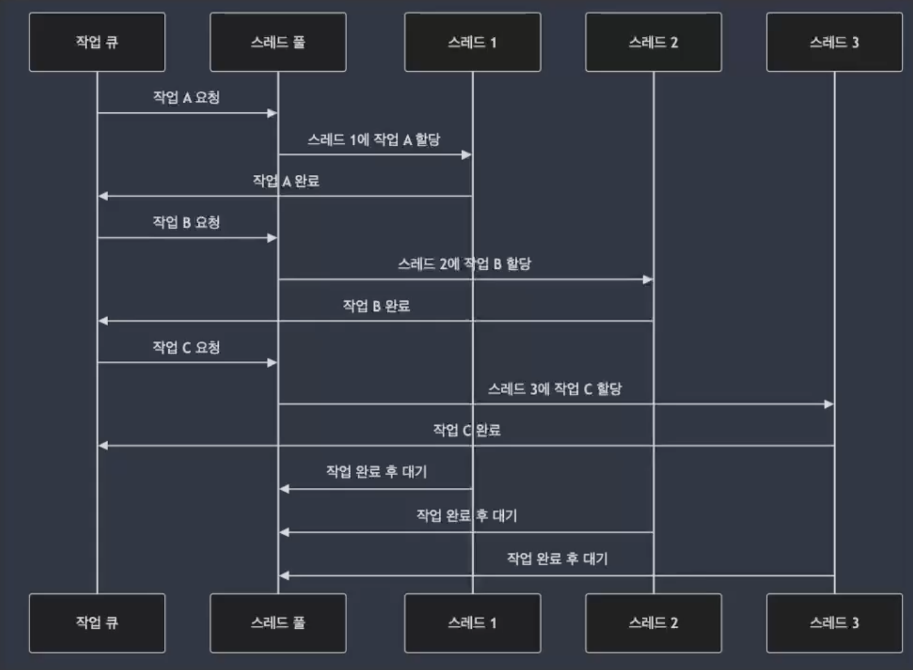
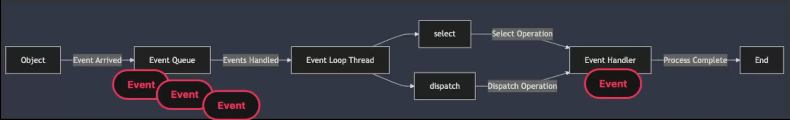

## 02. 동시성 및 비동기 처리를 위한 기본 구조

### 스레드 풀(Thread Pool)의 구조 및 활용 : 스레드 풀 (Thread Pool)

- 미리 생성된 스레드의 집합, 작업이 들어올 때마다 새로운 스레드를 생성하는 대신, 이미 생성된 스레드를 재사용하여 작업을 처리
- 스레드 풀을 사용하면 스레드 생성 및 소멸에 따른 오버헤드를 줄일 수 있어, 동시성 처리에서 자원을 효율적으로 관리

### 스레드 풀(Thread Pool)의 구조 및 활용 : 스레드 풀의 구조 및 특징



- 스레드 풀은 **여러 작업을 동시에 처리하기 위해 미리 생성된 스레드의 집합을 유지**
- 스레드 풀에 작업을 제출하면, **해당 작업이 스레드 풀의 사용 가능한 스레드에 할당**
- 스레드가 **작업을 마치면, 그 스레드는 다른 작업에 할당되기 전까지 대기 상태**

### 스레드 풀(Thread Pool)의 구조 및 활용 : Java의 Executors API

```java
import java.util.concurrent.ExecutorService;
import java.util.concurrent.Executors;

public class ThreadPoolExample {
    public static void main(String[] args) {
        // 3개의 스레드로 구성된 고정된 스레드 풀 생성
        ExecutorService executor = Executors.newFixedThreadPool(3);
        
        // 스레드 풀에 작업을 제출
        for (int i = 1; i <= 5; i++) {
            final int taskID = i;
            executor.submit(() -> {
                System.out.println("Task "+ taskID + " is running in thread " + Thread.currentThread().getName());
            });
        }
        
        // 스레드 풀 종료
        executor.shutdown();
    }
}
```

- 작업이 끝난 스레드는 재사용 가능 → 불필요한 스레드 생성 및 제어 감소
- 스레드 풀이 너무 작으면 처리량이 제한 될 수 있고, 너무 크면 메모리 및 CPU 리소스의 과도한 사용이 발생할 수 있음

### Q. 스레드 풀을 사용할 때, 자원을 효율적으로 사용하려면 어떤 요소를 고려해야할까?

- 스레드 풀의 크기
    - 너무 많은 스레드를 생상하면 스레드의 컨텐스트 스위치 비용이 증가, 시스템의 전반적인 성능 저하
    - 반대로 너무 작으면 CPU 자원이 충분히 활용되지 않을 수 있기 때문에 CPU 코어수와 자원의 특성을 고려해서 최적의 스레드 수를 결정해야 한다.
- 작업의 종류
    - CPU 집약적인 작업 : 스레드를 CPU 코어수에 맞추기
    - IO 집약적인 작업 : 스레드가 대기하는 시간이 많기 때문에 더 많은 스레드를 할당해서 대기시간동안 다른 작업을 처리할 수 있도록 하는 것이  좋음
- 스레드 생성과 파괴의 비용
    - 스레드를 자주 생성하고 파괴하는 것은 비용이 많이 듬
        
        → 스레드풀을 사용함으로써 스레드의 생성 비용을 절약하고 재사용 가능
        
    - 스레드풀 설정을 통해 초기 스레드 수, 최대 스레드 수, 요구 시간 등을 조절하여 스레드 풀을 동적으로 조절하는 방법도 좋음
- 메모리 사용량
    - 각 스레드는 자신의 스택메모리를 필요로 함 → 스레드가 증가하면 메모리 샤용량도 증가
- 동기화 문제
    - 락 경쟁을 최소화, 락 프리 알고리즘을 고려하는 것이 좋음
- 응답 시간과 처리량
    - 스레드 풀 설정을 조절해서 특정 어플리케이션의 요구사항에 맞게 최적화를 해야한다.
    - 빠른 응답 시간이 중요한 어플리케이션의 경우 → 스레드 풀의 스레드 수를 증가시켜 대기 시간을 줄일 수 있다.

[비동기 처리(Asynchronous Processing)의 개념과 필요성](1%ED%8B%B0%EC%96%B4%20%ED%8C%A8%EC%85%98%20%EC%BB%A4%EB%A8%B8%EC%8A%A4%20%EC%84%B8%EC%9D%BC%20%EB%8F%84%EB%A9%94%EC%9D%B8%20%ED%94%84%EB%A1%9C%EC%A0%9D%ED%8A%B8%EB%A1%9C%20%EB%B0%B0%EC%9A%B0%EB%8A%94%20%EB%8C%80%EA%B7%9C%EB%AA%A8%20%ED%8A%B8%EB%9E%98%ED%94%BD%EC%9D%84%20%EA%B2%AC%EB%94%94%EB%8A%94%20%EC%8B%A4%EC%A0%84%20%EB%B0%B1%EC%97%94%EB%93%9C%EC%9D%98%20%EB%AA%A8%202ee08be504e6806fa143e989879ae681.md) 

### 비동기 처리와 이벤트 루프 : 이벤트 루프 (Event Loop)



- 이벤트 루프(Event Loop)는 **비동기 처리를 위한 구조로, 하나의 스레드가 여러 작업을 순차적으로 처리하는 방식**
- 입출력 (I/O) 작업에서 매우 효율적
- 이벤트 루프는 **단일 스레드 기반으로 동작하며, 비동기 작업이 완료될 때마다 이벤트 큐에 있는 작업을 처리**

### 비동기 처리와 이벤트 루프 : Java의 비동기 이벤트 루프

```java
import java.nio.ByteBuffer;
import java.nio.channels.AsynchronousFileChannel;
import java.nio.file.Path;
import java.nio.file.Paths;
import java.util.concurrent.Future;

public class EventLoopExample {
    public static void main(String[] args) {
        try {
            Path filePath = Paths.get("example.txt");
            AsynchronousFileChannel fileChannel = AsynchronousFileChannel.open(filePath); // 비동기 파일 읽기
            
            ByteBuffer buffer = ByteBuffer.allocate(1024);
            Future<Integer> result = fileChannel.read(buffer, 0);  // 비동기 작업의 결과를 나중에 받아옴 -> 파일을 읽는 동안 다른 작업 수행 가능
            
            while (!result.isDone()) {
                System.out.println("File is being read asynchronously...");
            }
            
            System.out.println("Read " + result.get() + " bytes from the file.");
        } catch (Exception e) {
            e.printStackTrace();
        }
    }
}

```

→ 하나의 스레드로 많은 비동기 작업 처리 가능

→ 이벤트 루프는 단일 스레드로 동작하기 때문에 CPU 부하가 큰 작업을 처리하는데는 적합하지 않음 → CPU 집약적인 작업에 적합하지 않음

### Q. 이벤트 루프가 입출력 작업에 왜 적합한가?

- 논블로킹(Non-Blocking) I/O 모델
    - 이벤트 루프가 입출력 요청을 발생시키고 완료될때까지 기다리지 않고 즉시 다음 작업으로 넘어간다. → 입출력 작업이 진행하는 동안 CPU는 다른 작업 처리 가능 ⇒ 시스템의 전반적인 처리작업 능률이 향상
- 효율적인 자원 사용
    - 입출력 작업은 대부분 대기시간이 긴 작업(`ex_` 네트워크 요청을 보내고 응답을 기다리는 경우, 파일을 읽는 경우 등)→ 대기시간이 발생하는 이벤트 루프는 다른 이벤트 루프를 처리할 수 있다.
        
        → 전체적인 시스템의 가능성과 효율성 증가
        
- 반응성 유지
    - 사용자의 입력이나 외부 요청에 대해 빠르게 반응
        
        →실시간으로 반응해야하는 어플리케이션에서는 큰 장점
        

### 비동기 작업의 오류 처리 및 콜백 패턴 : Java의 비동기 API 디자인 패턴

- **콜백 패턴 (Callback Pattern)**
    - 콜백 함수는 비동기 작업이 완료된 후 실행될 작업을 미리 등록
    - 단순하고 효율적이지만, 여러 작업이 중첩될 경우 콜백 지옥(Callback Hell)의 구조가 될 수 있음

```java
interface Callback {
    void onComplete(String result);
}

public class CallbakExample {
    public stativ void main(String[] args) {
        asyncOperation(result -> {
            System.out.println("결과: " + result);
        });
    }
    
    public static void asyncOperation(Callback callback) {
        new Thread(() -> {
            try {
                Thread.sleep(1000); // 작업 시뮬레이션
                callback.onComplete("작업 완료");
            } catch (InterruptedException e) {
                e.printStackTrace();
            }
        }).start();
    }
    
}
```

- **CompletableFuture**
    - 비동기 작업 관리 → 비동기 작업의 결과를 비동기적으로 처리할 수 있는 Java의 강력한 API
    - JavaScript의 Promise와 유사, 비동기 작업을 처리한 후 그 결과를 사용해 후속 작업 가능
    - 복잡한 작업에서는 코드가 길어질 수 있다는 단점이 있다. → 비동기 과정에서 오류가 발생하면 추가적인 관리가 필요

```java
CompletableFutrue<String> future = CompletableFuture.supplyAsync(() -> {
    try {
        Thread.sleep(1000);  // 비동기 작업 시뮬레이션
    } catch (InterruptedException e) {
        e. printStackTrace();
    }
    return "작업 완료";
});

future.thenApply(result -> {
    System.out.println("결과: " + result);
    return result + " - 후속 작업 완료";
}).thenAccept(System.out::println);
```

### 👇 비동기 작업의 오류 처리 및 콜팩 패턴 : 비동기 처리시 유의사항

- **스레드 안정성(Thread Safety)** : 스레드가 공유 자원에 접근할 때, 적절한 동기화 메커니즘 필요(`ex_` synchronized)
    
    ```java
    class Counter {
        private int count = 0;
        
        public synchronized void increment() {
            count++;
        }
        
        public int getCount() {
            return count;
        }
    }
    ```
    
- **예외 처리 필요** : CompletableFuture에서 exceptionally()를 사용하여 비동기 작업에서 발생한 예외 처리
    
    ```java
    CompletableFuture.supplyAsync(() -> {
        if (true) throw new RuntimeException("예외 발생!");
        return "작업 성공";
    }).exceptionally(ex -> {
        System.err.println("오류: " + ex.getMessage());
        return "대체 결과";
    }).thenAccept(System.out:println);
    ```