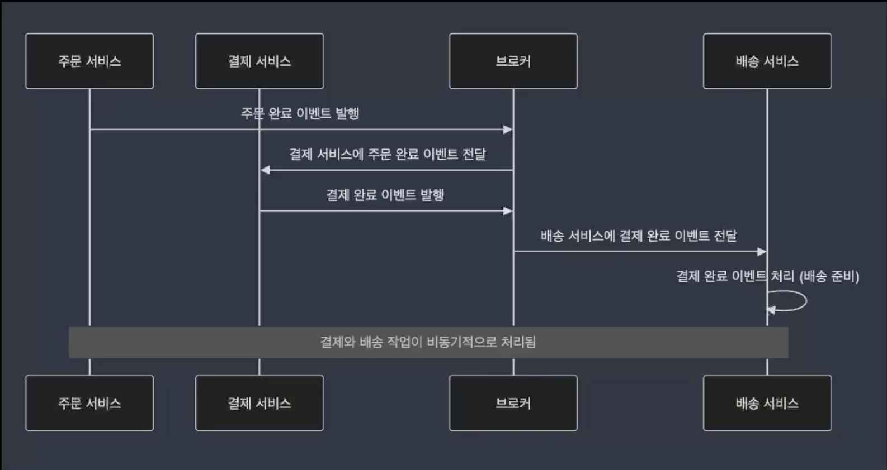

## 01. 비동기 처리 아키텍처 개요

### 비동기 처리 시스템의 이해 : 비동기 처리의 개념

- 비동기 처리 작업은 병렬로 수행 → 하나의 작업이 완료되기까지 기다리지 않고 다른 작업을 시작할 수 있는 방식
- I/O 작업에서 대기 시간이 길어질 경우, 프로그램은 다른 작업을 처리하며 대기 시간을 효율적으로 사용

### 비동기 처리 시스템의 이해 : 비동기 처리의 필요성

- 동기 처리와 비동기 처리의 차이점
    - 동기 처리 : 작업이 완료될 때까지 호출자가 대기하는 방식
        
        → 한 작업이 끝나기 전까지 다른 작업을 수행할 수 없음
        
    - 비동기 처리 : 호출자가 대기하지 않고, 작업이 끝났을 때 콜백이나 이벤트를 통해 작업 완료를 알림

### 비동기 처리 시스템의 규모 확장 : 단일 프로세스에서 비동기 처리

- 작은 시스템에서는 자원의 효율적 사용이 중요함
- I/O 작업(파일 읽기, 네트워크 요청 등)은 처리 시간이 길어질 수 있음
- 비동기 처리를 통해 그 대기 시간을 활용하여 다른 작업을 진행함으로써 전체 성능을 향상시킬 수 있음
- CPU 자원이 놀지 않고 게속 작업을 처리하도록 돕는 것이 비동기 처리의 핵심 장점

- **Java에서 비동기 처리의 기본 구성**
    - 스레드 풀(Thread Pool)
        
        → 단일 프로세스에서 스레드 풀은 미리 여러 스레드들을 생성해두고 필요한 작업이 발생하면 스레드를 재사용할 수 있다.
        
        → 매번 스레드를 생성하지 않기 때문에 성능 오버헤드를 줄일 수 있고, 작업당 빠르게 전환할 수 있다.
        
    - 이벤트 루프(Event Loop)를 활용한 비동기 처리
        
        → 단일 스레드에서 여러 비동기 작업을 처리하는 방식 (ex_ 이벤트가 발생하면 큐에 저장하고, 이벤트 루프는 큐에서 하나씩 작업을 꺼내 처리) → 주로 I/O 작업에 적합 
        
        → 자바에서는 CompletableFuture나 nonblocking i/o(NIO)를 사용하여 구현
        
    
    ```java
    ExecutorService executor = Executors.newFixedThreadPool(5);
    executor.submit(() -> {
            // 비동기 작업 실행
    });
    
    AsynchronousFileChannel fileChannel = AsynchronousFileChannel.open(filePath, ...);
    ByteBuffer buffer = ByteBuffer.allocate(1024);
    fileChannel.read(buffer, 0, buffer, new CompletionHandler<Integer ByteBuffer>
            @Override
            public void completed(Integer result, ByteBuffer attachment) {
                    // 파일 읽기 완료 후 처리
            }
            
            @Override
            public void failed(Throwable exc, ByteBuffer attachement) {
                        // 오류 처리
            }
    });
    ```
    

### 비동기 처리 시스템의 규모 확장 : 대규모 시스템에서의 비동기 처리

- 대규모 시스템에서는 많은 요청이 동시에 들어오고, 이러한 요청을 효율적으로 처리하기 위해서는 비동기 처리가 필수적
- **트래픽이 많은 환경에서 비동기 처리를 통해 시스템의 확장성과 안정성을 보장할 수 있음**
- 이때 비동기 메시징 시스템 사용하여 아키텍처를 확장

### 비동기 메시징 시스템 이해

- 비동기 메시징 시스템은 시스템 간 또는 애플리케이션 내부의 여러 구성 요소 간 통신을 비동기적으로 처리하는 방식
- 작업이 비동기적으로 처리되기 때문에 각 구성 요소가 독립적으로 작업을 수행할 수 있어(독립적이므로 자신의 작업 속도에 맞게 메시지를 보낼 수 있고, 메시지가 처리되는 동안 다른 작업을 처리할 수 있음), 시스템의 확장성과 성능을 크게 향상시킬 수 있음
    
    👇 장점 3가지
    
    - `독립성` `확장성` `성능향상`
        
         → 비동기 처리를 통해 시스템은 동시에 더 많은 요청 처리 가능, 시스템 부하 증가 시 필요한 자원을 쉽게 확장
        
        → 처리 지연 최소화
        
        → 대규모 트래픽이나 복잡한 요청 처리에서 시스템의 성능을 크게 향상
        
- **메시지 큐(Message Queue)**와 **메시지 브로커(Message Broker)**가 이러한 비동기 메시징 시스템의 핵심 요소

### 비동기 메시징 시스템 이해 : 메시지 큐와 메시지 브로커

- **메시지 큐 (Message Queue)** : (생산자:Producer는) 메시지를 큐에 저장해 두고, 소비자(Consumer)가 준비되면 메시지를 비동기적으로 처리하는 역할
    
    → 시스템 병목 현산 없이 메시지 처리 가능
    
    → 큐에 쌓인 메시지는 순서대로 처리, 각 메시지는 단일 소비자에 의해 소비된다.
    
    → ex_ 이메일 전송, 배치 작업 등 시간이 걸리는 작업을 비동기 작업으로 처리
    
- **메시지 브로커 (Message Broker)** : 이벤트 브로커는 발행-구독 패턴을 기반으로 여러 서비스가 이벤트를 구독하고, 특정 이벤트가 발생할 때 이 이벤트를 비동기적으로 구독자에게 전달
    
    → 생산자(Producer)는 메시지를 브로커에게 전달, 구독자(Subscriber)는 특정 주제(Topic)에 대한 메시지를 구독, 이벤트가 발생하면 동시에 여러 구독자에게 메시지 전달
    
    → 이를 통해 여러 구성 요소가 동일한 메시지를 실시간으로 처리할 수 있음 (`ex_` 주문 처리 시스템에서 새로운 주문이 들어오면 결제, 재고관리 등 여러 서비스가 동시에 처리 가능, 금융거래, 로그 처리, IOT 센서 데이터 수집 등에서 실시간으로 발생하는 데이터를 여러 소비자에게도 동시에 전달 가능)
    

### 비동기 메시징 시스템 이해 : 메시징 시스템을 통한 비동기 처리

- **한 서비스가 작업을 완료하기 전에 메시지를 큐에 넣고, 다른 서비스가 비동기적으로 이를 처리함으로써 시스템의 부하를 줄일 수 있음**
- 비동기 메시징 시스템의 간단한 적용
    
    ```java
    @Service
    public class MessageProducer {
            @Autowired
            private AmqpTemplate amqpTemplate;
            
            public void sendMessage(String message) {
                    amqpTemplate.convertAndSend("exchangeName", "routingKey", message);
            }
    }
    ```
    
    → rabbitmq 사용하여 클라이언트가 보내는 메시지를 큐에 저장 ⇒ 비동기적으로 처리 (위 예시는 rabbitmq와 Spring Amqp를 사용)
    

### 비동기 메시징 시스템의 역할 : Message Queue


- Message Queue는 트래픽이 폭주할 때 이를 적절히 분산시켜 처리할 수 있는 비동기 처리의 핵심 요소
- 메시지 큐는 대규모 시스템에서 producer와 consumer가 독립적으로 동작을 할 수 있게 해주고 작업을 큐에 넣고 consumer가 준비되었을 때 이를 처리하도록 설계
- 비동기 처리에서 자주 사용되는 작업 큐는 **요청을 처리하기 위해 순차적으로 저장된 작업을 관리**
- **Producer가 메시지를 큐에 넣고, Consumer는 큐에서 메시지를 꺼내 비동기적으로 처리 (여러 소비자가 동시에 메시지 처리 가능)**
    
    → consumer의 수를 유동적으로 확장 가능(시스템의 확장성을 가져갈 수 있는 구조)
    
    → 트래픽이 몰리면 consuemr 수를 늘려 메시지를 더 빠르게 처리 → 트래픽이 순간적으로 폭주해도 모든 요청을 실시간으로 처리하지 않아도 되기 때문에 시스템 안정성 유지 가능
    
- 큐는 작업을 병렬로 분산 처리하는 데 중요한 역할

### 비동기 메시징 시스템의 역할 : Event-Driven Architecture

- **서비스 간 느슨한 결합과 실시간 반응성을 제공하는 또 다른 비동기 메시징 시스템**
- 이벤트 기반 아키텍처는 **시스템 내에서 발생하는 상태 변화를 이벤트로 처리하고, 각 서비스는 이 이벤트에 비동기적으로 반응**하는 구조



→ 이벤트 Producer는 특정 이벤트(주문완료, 결제완료 등)를 발생

→ 이벤트 브로커가 해당 이벤트를 구독하고 있는 여러 Consumer에게 비동기적으로 이벤트 전달

→ 이벤트를 구독한 Consumer는 각 다른 서비스나 모듈에서 해당 이벤트를 처리

→ 주문 서비스가 결제가 완료되면 배송 서비스는 해당 정보를 비동기적으로 받아 처리

→ 결제 서비스는 비동기적으로 배송 이벤트를 처리하기 때문에 결제와 배송작업이 동시에 진행 ⇒ 전체 처리속도 빨라짐

### 비동기 메시징 시스템의 확장성과 안정성 보장

- **확장성**
    - 메시지 큐나 이벤트 버스는 필요에 따라 소비자 또는 서비스 인스턴스를 동적으로 추가할 수 있어, 대규모 트래픽을 처리하기 위한 확장성을 보장
- **안정성**
    - 각 서비스가 독립적으로 동작할 수 있어 시스템의 한 부분에 문제가 생기더라도 전체 시스템이 중단되지 않고 작동
