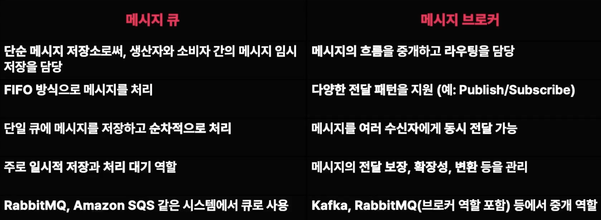
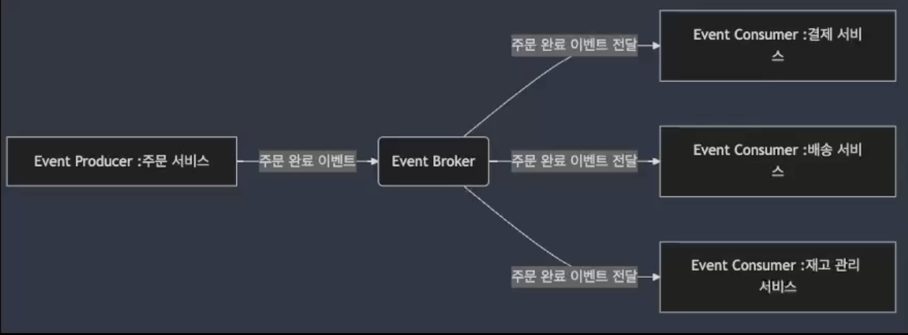
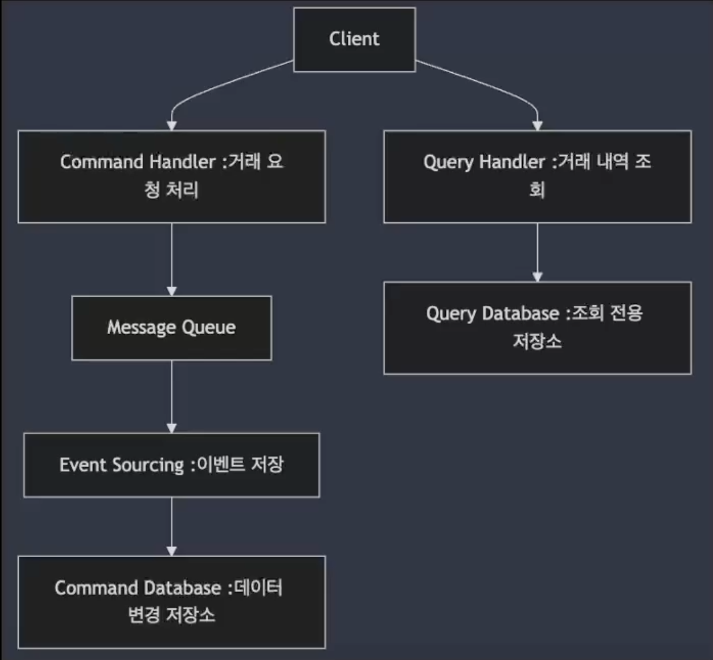
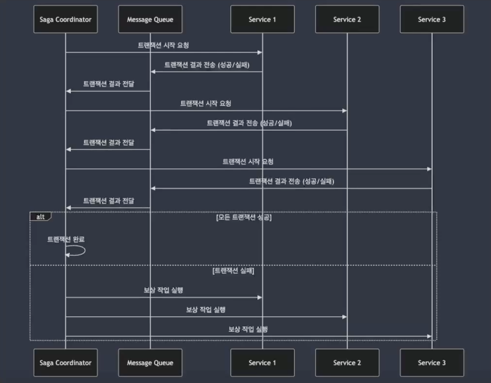

## 02. 비동기 메시징 시스템 이해

### 비동기 메시징 시스템이란?

- 프로듀서(Producer)와 컨슈머(Consumer)가 독립적으로 동작하며, 서로 직접적으로 데이터를 주고받지 않고 메시지 큐나 이벤트 버스와 같은 중간 매체를 통해 통신하는 시스템
- **비동기 메시징 시스템의 필요성**
    - 대규모 시스템에서는 매 순간 수많은 요청이 동시에 들어오며, 이를 모두 동기적으로 처리하게 되면 시스템에 과부하가 발생할 수 있음
    - 이때 비동기 메시징 시스템은 트래픽을 효율적으로 분산하고, 확장성을 보장하는 데 중요한 역할
    - 주요 목적은 시스템 간 느슨한 결합과 작업의 병렬 처리를 통해 효율성을 극대화

### 이벤트 버스 (Event Bus)

- **이벤트 버스는 시스템 내에서 발생하는 이벤트를 전달하는 비동기 메시징 시스템**
- 이벤트는 시스템 내의 상태 변화나 사용자 액션에 의해 발생하며, 이를 처리하기 위해 비동기적으로 여러 서비스 간에 전달
- **이벤트 버스의 동작 원리**
    - Event Producer : 이벤트를 발생시키는 주체
    - Event Bus : 이벤트를 구독하고 있는 여러 서비스로 전달하는 역할
    - Event Consumer : 이벤트를 구독하고 있는 서비스

### 메시지 큐 (Message Queue)

- **메시지 큐는 프로듀서가 생성한 메시지를 큐에 넣고, 이를 소비자가 준비된 후에 처리하는 구조**
- 이 방식은 서비스 간 느슨한 결합을 가능하게 하고, 확장성을 높이는 데 유용함
- **메시지 큐의 동작 원리**
    - Producer : 메시지를 생성하여 큐에 넣는 주체
    - Queue : 메시지가 일시적으로 저장되는 공간 (Queue에 쌓인 메시지는 즉시 처리되지 않고 소비자가 준비되면 순차적으로 처리가 되는 방식)
    - Consumer : 큐에서 메시지를 가져가 처리하는 주체 → 여러 소비자가 동시에 메시지를 처리할 수 있어 병렬 처리 가능

⇒ 순간적으로 트래픽이 몰려도 메시지가 큐에 저장되어 순차적으로 처리가 될 수 있고 Consumer수를 늘리면 큐에 쌓인 메시지를 빠르게 처리할 수 있어 트래픽 증가에 유연하게 대응할 수 있음.

⇒ 서비스간의 결합도를 줄여서 각 서비스가 독립적으로 작동할 수 있도록 함

### 메시지 브로커(Message Broker)

- **메시지 브로커는 메시지 큐나 이벤트 버스와 비슷한 개염이지만, 더 큰 범위에서 시스템 간 통신을 중개하는 역할**
- 메시지 브로커는 서로 다른 애플리케이션이나 시스템 간에 비동기 메시지를 전달
- RabbitMQ, Kafka와 같은 도구가 여기에 해당
- 메시지 브로커는 한번 더 메시지를 가공을 하거나 번역을 해서 전달
- **브로커의 주요 역할**
    - 메시지 저장 : 메시지를 큐에 저장하여, 시스템이 메시지를 손실하지 않고 안정적으로 전달
    - 트래픽 분산 : 브로커는 트래픽을 효율적으로 분산시켜 시스템에 과부하가 발생하지 않도록 도와줌
    - 서비스 간 중재 : 서로 다른 시스템 간의 메시지를 중개하여, 각 시스템이 독립적으로 동작할 수 있도록 함

⇒ 브로커는 메시지를 안전하게 저장하고 소비자가 준비될 때 까지 메시지를 유지시킬 수 있어 시스템의 안정성을 높일 수 있음

⇒ 브로커를 통해 많은 트래픽 처릭 가능하여 소비자 수를 자유롭게 늘려 확장성 보장

⇒ 장애 발생 시 메시지를 읽지않고 시스템이 복구되면 메시지를 다시 처리 가능

### Message Queue vs Message Broker

### 주요 비동기 메시징 시스템 : Apache Kafka

- **분산 처리** : Kafka는 클러스터로 구성되어 대규모 데이터를 분산 처리하며, 수평적으로 확장 가능
- **높은 처리량과 지연 시간 최소화** : Kafka는 고속의 데이터 처리량을 제공하며, 실시간 데이터 스트리밍 처리에서 매우 적합 (대용량 트래픽에서도 성능 저하가 적음)
- **토픽(Topic) 기반 구조** : Kafka는 데이터를 토픽으로 관리. 프로듀서가 메시지를 특정 토픽에 게시하면, 이를 구독한 여러 소비자가 동시에 데이터를 처리할 수 있음
- **순서 보장** : Kafka는 각 파티션 내에서 메시지의 순서를 보장하며, 메시지의 손실 없이 내구성을 보장하는 로그 저장 방식을 채택
- **내구성 보장** : Kafka는 데이터를 디스크에 저장하며, 메시지의 손실을 방지하기 위해 복제(replication) 지원

→ kafka는 분산용 메시징 시스템

→ 주로 실시간 데이터 처리 및 이벤트 기반 시스템에서 사용

→ 고속 처리, 고가용성 제공

→ `ex_` 실시간 로그 분석,  데이터 스트리밍, 이벤트 소싱 등에 사용, 시스템 로그를 실시간으로 수집 및 분석, 대규모 스트리밍 데이터 처리에 사용, 소셜 미디어, 피드. 센서 데이터 수집에도 활용

→ kafka는 이벤트 로그를 중앙에서 관리, 이벤트를 각 서비스가 구독해서 처리

### 주요 비동기 메시징 시스템 : RabbitMQ

- **큐 기반 구조** : 프로듀서가 메시지를 큐에 넣고, 컨슈머가 그 큐에서 메시지를 가져가 처리하는 방식. 이는 메시지를 비동기적으로 처리하는 데 적합함
- **메시지 라우팅** : RabbitMQ는 메시지 라우팅 옵션을 제공하여, Direct Exchange, Fanout Exchange, Topic Exchange 등을 통해 특정 조건에 맞는 메시지를 큐로 전달
- **스케줄링 및 우선 순위 메시징** : RabbitMQ는 메시지를 우선순위(priority)를 설정할 수 있으며, 메시지의 스케줄링도 지원
- **내구성 있는 메시지 저장** : 메시지를 디스크에 저장하여 시스템 장애 발생 시에도 메시지 손실을 방지
- **확장성** : 클러스터링을 통해 RabbitMQ를 확장할 수 있으며, 분산 처리 환경에서 높은 가용성을 제공

→ AMQP를 신뢰성있는 메시지 전달을 보장 (중요한 메시지 손실 방지)

→ 지연 메시지 기능 활용 가능

→ `ex_` 금융서비스 거래 시스템

### 주요 비동기 메시징 시스템 : Amazon SQS (Simple Queue Service)

- **완전 관리형 서비스** : AWS가 시스템을 관리, 사용자는 인프라를 신경 쓰지 않고 서비스 구축에 집중
- **자동 확장** : Amazon SQS는 트래픽의 변화에 따라 자동으로 확장. 대규모 메시지 트래픽을 처리할 때 추가적인 설정 없이 시스템이 자동으로 대응
- **메시지 전달 보장** : 최소 한 번 메시지를 전달하는 At least once 방식이 기본으로 제공되며, FIFO 큐를 선택하면 메시지의 순서를 보장
- **지연 큐** : Amazon SQS는 메시지를 일정 시간 동안 대기시킨 후 처리할 수 있는 지연 큐(Delay Queue) 기능을 제공. 이 기능은 특정 조건에서 메시지를 지연 처리해야 할 때 유용함
- **비용 효율성** : 클라우드 기반 서비스로, 사용한 만큼만 비용을 지불하면 됨.

### 메시징 시스템 선택 시 고려사항

- **처리 속도**
    - 메시징 시스템의 처리 속도는 시스템의 성능을 결정짓는 중요한 요소
    - 높은 처리량을 필요로 하는 시스템에는 Apache Kafka와 같은 시스템이 적합
    - 높은 신뢰성과 정밀한 메시지 전달이 중요하다면 RabbitMQ가 유리
- **메시지 전달 보장**
    - 메시지가 반드시 한 번 전달되는지(Exactly once)
    - 최소 한 번 전달되는지(At least once)
    - 적어도 한 번 이상 전달될 수 있는지(At most once)
- **확장성**
    - 시스템이 부하가 늘어났을 때 대응할 수 있는 능력
- **사용 사례에 맞는 기능**
    - 각 메시징 시스템은 고유의 기능을 제공
    - RabbitMQ는 메시지 라우팅 기능이 뛰어남
    - Kafka는 로그 기반의 메시징 처리에 최적화
    - Amazon SQS는 손쉬운 클라우드 관리형 서비스를 제공

### 비동기 메시징 시스템의 주요 패턴 : Event-Driven Architecture

- **이벤트 기반 아키텍처는 시스템의 각 구성 요소들이 특정 이벤트에 반응하여 작업을 처리하는 방식**
- 이벤트가 발생하면 이를 다른 서비스나 모듈이 구독하고, 이벤트가 도착하면 해당 작업을 비동기적으로 처리하는 구조

- **구성 요소**
    - Event Producer : 이벤트를 발생시키는 주체
    - Event Consumer : 이벤트를 구독하고 이를 처리하는 주체
    - Event Broker : 이벤트를 구독자들에게 전달하는 중개 역할

### 비동기 메시징 시스템의 주요 패턴 : CQRS (Command Query Responsibility Segregation)

- **명령(Command)과 조회(Query)를 분리하여 각각 독립적으로 처리하는 아키텍처 패턴**
- **명령은 데이터를 변경하는 작업을 의미하며, 조회는 데이터를 읽는 작업을 의미**

→ 비동기 메시징 시스템과 함께 사용, 성능과 확장성을 높임

- **구성 요소**
    - Command Handlers : 데이터를 변경하는 작업을 처리, 이때 메시지 큐를 사용해 명령이 큐에 저장되고, 비동기적으로 처리
    - Query Handlers : 데이터를 조회하는 작업을 처리. 데이터 조회는 즉각적으로 처리될 수 있지만, 명령은 비동기적으로 처리되어 데이터 일관성을 유지
    - Event Sourcing : 모든 상태 변경을 이벤트로 기록하고, 이벤트를 통해 시스템의 상태를 재구성하는 방식

→ 데이터의 읽기와 쓰기가 분리되기 때문에 성능 최적화 가능, 특히 쓰기 작업은 비동기적으로 처리가 되어 시스템의 부하를 줄일 수 있음

→ 명령과 조회를 독립적으로 확장 가능

→ `ex_` 금융 시스템에서 거래 요청은 명령으로 처리되어 메시지큐에 저장되어 비동기적으로 처리되지만 거래 내역 조회는 즉각적으로 처리 가능

### 비동기 메시징 시스템의 주요 패턴 : 사가 패턴 (Saga Pattern)

- **분산 트랜잭션을 처리할 때 사용되는 아키텍처 패턴으로, 각 서비스에서 독립적으로 트랜잭션을 처리하지만, 전체 프로세스는 논리적으로 하나의 트랜잭션처럼 보이게 함**
- **사가 패턴은 각 서비스에서 처리된 결과를 비동기적으로 전달받아 트랜잭션을 완성하거나 실패했을 경우 보상 작업을 수행**
- **구성 요소**
    - Saga Coordinator : 트랜잭션의 시작과 종료를 관리하며, 중간에 트랜잭션이 실패할 경우 보상 작업을 실행
    - Local Transactions : 각 서비스에서 실행되는 독립적인 트랜잭션으로 각 서비스는 메시지 큐를 통해 비동기적으로 트랜잭션 결과를 전달

→ Saga 패턴을 활용하면 분산 트랜잭션 처리가 가능 ⇒ 여러 서비스가 참여하는 트랜잭션을 일관성 있게 처리 가능

→ 분산 처리를 함으로써 서비스간에 느슨한 결합 유지, 트랜잭션이 비동기적으로 처리되더라도 확장성 확보 가능

### 비동기 메시징 시스템의 주요 패턴 : 백프레셔 패턴 (Backpressure Pattern)

- **시스템이 과부하 상태일 때 요청을 거부하거나 처리 속도를 늦추는 방식으로 트래픽을 조절하는 아키텍처 패턴**
- **비동기 메시징 시스템과 함께 사용되며, 대규모 트래픽 상황에서 시스템의 안정성을 보장하는 데 도움**
- **구성 요소**
    - Producer : 메시지를 생성하여 큐에 넣는 역할을 하지만, 큐가 가득 차면 백프레셔를 통해 메시지 생산을 중단하거나 속도를 늦춤
    - Consumer : 메시지를 처리하는 소비자로서, 큐에서 처리할 수 있는 메시지의 양을 제어하여 시스템 과부하를 방지

→ 과부하 상태에서도 시스템이 중단되지 않고 안정적으로 작동할 수 있다는 장점

→ 비동기적으로 처리되는 메시지 양을 조절하여 과도한 트래픽으로 인한 시스템 장애를 예방

→ 스트리밍 플랫폼에서 실시간 데이터 전송중에 트래픽이 급격히 증가하면 백프레셔를 통해 시스템이 처리할 수 있는 만큼의 요청만 받아들이고 나머지는 대기 또는 거부 가능

### 비동기 메시징 시스템의 주요 패턴 : Durable Messaging Pattern

- **메시지를 손실 없이 처리할 수 있도록 보장하는 패턴**
- 메시지가 중간에 손실되거나 누락되지 않도록 메시지를 저장하고, 시스템 장애 시에도 복구가 가능한 상태로 유지
- **구성 요소**
    - Persistent Queue : 메시지가 시스템에 도착하면 큐에 영구적으로 저장, 메시지는 실패 시 재시도될 수 있으며, 시스템이 복구된 후에도 메시지가 손실되지 않음
    - Retry Mechanism : 실패한 메시지를 재처리할 수 있는 메커니즘을 포함하여, 메시지가 손실되지 않도록 보장