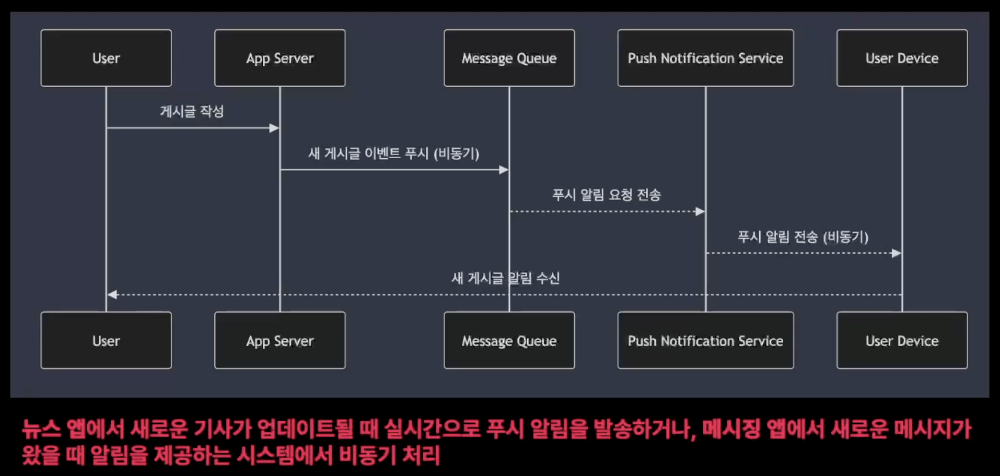
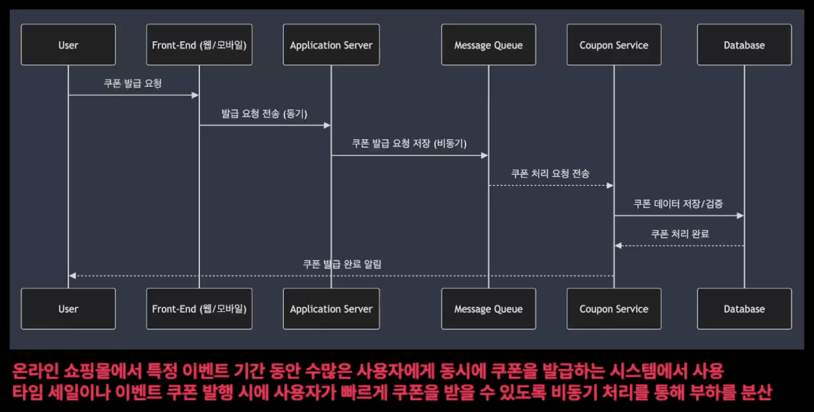
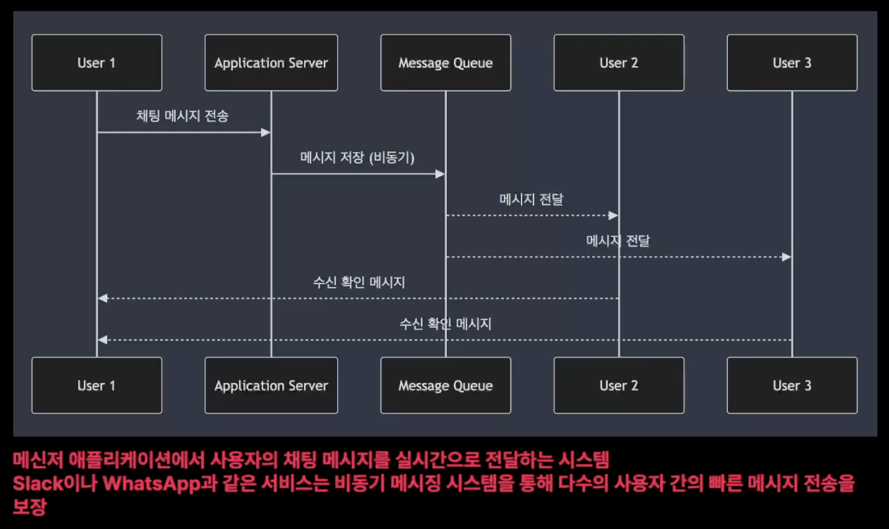
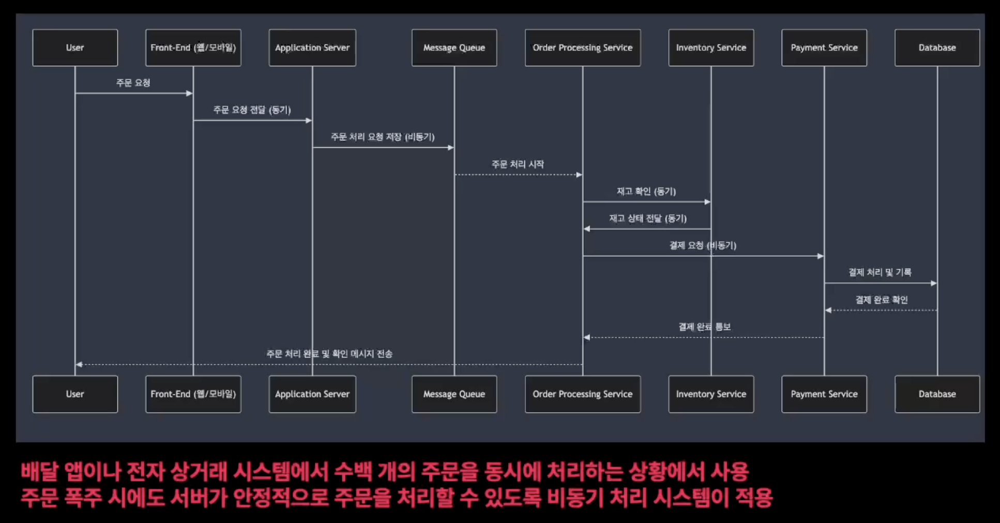
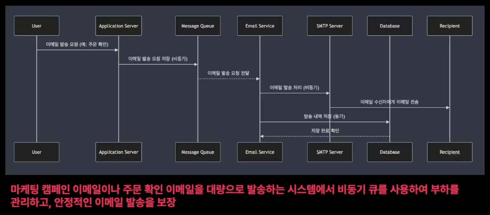

## 03. 비동기 처리 시스템의 장단점 및 사례

### 비동기 처리의 주요 장점

- 높은 확장성 (Scalability)
    - 비동기 처리 시스템은 시스템이 동시에 처리할 수 있는 작업의 수를 크게 늘리는 것이 가능
    - **특히 트래픽이 증가하는 상황에서도 시스템이 효율적으로 확장 가능함**
    - 여러 사용자 요청이 동시에 발생하더라도 작업 대기 없이 빠르게 처리할 수 있음 → 웹 서버에서 비동기 I/O를 사용하면 수천, 수만명의 동시 접속 처리 가능
- 시스템 리소스 최적화 (I/O 대기 시간 감소)
    - 비동기 시스템은 I/O 대기 시간을 줄여 시스템 리소스를 최적화
    - 동기적 방식에서는 작업 완료를 기다리면서 CPU나 메모리 자원을 낭비할 수 있지만, 비동기 방식에서는 대기 중에도 다른 작업을 처리
- 높은 응답성 (Responsiveness)
    - 비동기 시스템은 사용자에게 빠른 응답을 제공할 수 있음
    - 실시간 시스템에서 비동기 처리는 사용자 경험을 크게 향상

### 비동기 처리의 주요 단점

- 복잡한 오류 처리 및 디버깅
    - **비동기 시스템은 비동기적 흐름에서 발생하는 오류를 처리하고 디버깅하는 것이 복잡 할 수 있음**
    - 작업이 병렬로 처리되기 때문에 오류가 발생한 시점과 원인을 정확히 파악하기 어려움
- 순서 보장 문제 (Message Ordering)
    - 비동기 처리에서는 **메시지 순서 보장이 어려움**
    - **여러 작업이 동시에 실행되면서, 처리 순서가 중요한 경우 문제가 발생할 수 있음**
- 상태 관리의 어려움 (State Management)
    - 비동기 작업이 병렬로 처리되므로, 공유 상태에 대한 접근과 관리가 복잡해질 수 있음
    - 잘못된 상태 관리로 인해 데이터 일관성이 깨질 가능성이 존재

### 실제 비동기 처리 시스템의 예시

- 푸시 알림 시스템에서의 비동기 처리
    
    
    
    - 이벤트 기반 비동기 처리
        - 사용자의 특정 행동, 새로운 메시지 수신, 외부 이벤트 발생 시 비동기 이벤트가 트리거 됨
    - 메시지 큐와 푸시 시스템
        - 메시지 큐를 통해 푸시 알림 요청을 저장
        - 알림 서버에서 메시지를 소비하여 사용자에게 전달
        - 사용자가 실시간으로 메시지를 받으면서도 서버는 부하를 최소화시킬 수 있음
    - 실시간 알림 처리
        - 푸시 시스템은 비동기 I/O를 통해 다수의 사용자에게 동시에 알림 발송
        - 네트워크 대기를 요청하는 동안 다른 작업 처리 가능 → 높은 성능과 빠른 응답성을 제공받을 수 있음
- 쿠폰 발급 시스템에서의 비동기 처리
    
    
    
    - 쿠폰 발급 요청 비동기 처리
        - 수천명의 사용자가 동시에 쿠폰 발급 요청을 할 경우 비동기적으로 처리
        - 메시지 큐를 사용하여 순차적으로 처리 → 서버 과부하 방지
    - 쿠폰 발급 중복 방지 및 순차 처리
        - RabbitMQ나 Kafka같은 메시징 시스템을 통해 중복된 쿠폰 발급을 방지하고 요청을 처리
    - 비동기 작업으로 백엔드 처리 최적화
- 채팅 시스템에서의 비동기 처리
    
    
    
    - 메시지 큐 기반 처리
    - 실시간 데이터 전송
    - 다중 사용자 동시 처리
    
- 실시간 주문 처리 시스템에서의 비동기 처리
    
    
    
    - 주문 요청 비동기 처리
    - 재고 관리 시스템과의 비동기 통신
    - 결제 처리 비동기화

- 이메일 발송 시스템에서의 비동기 처리
    
    
    
    - 이메일 발송 큐 관리
    - 실시간 이메일 발송과 대기 처리
    - SMTP 서버와 비동기 통신