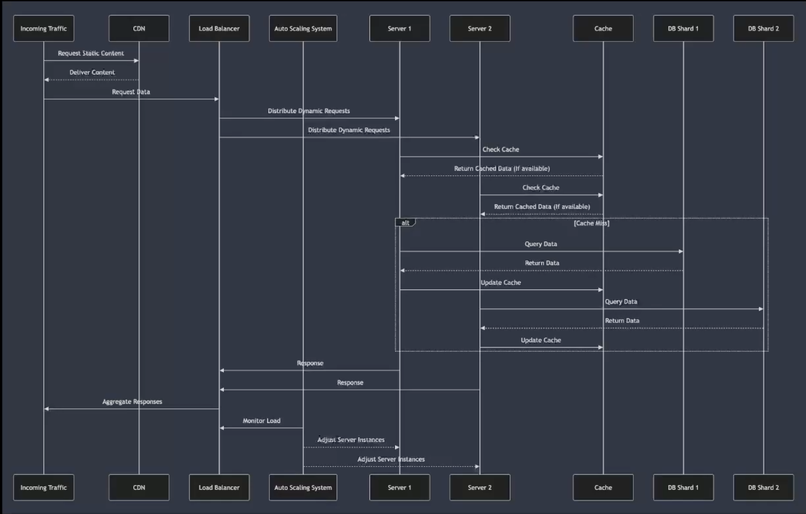
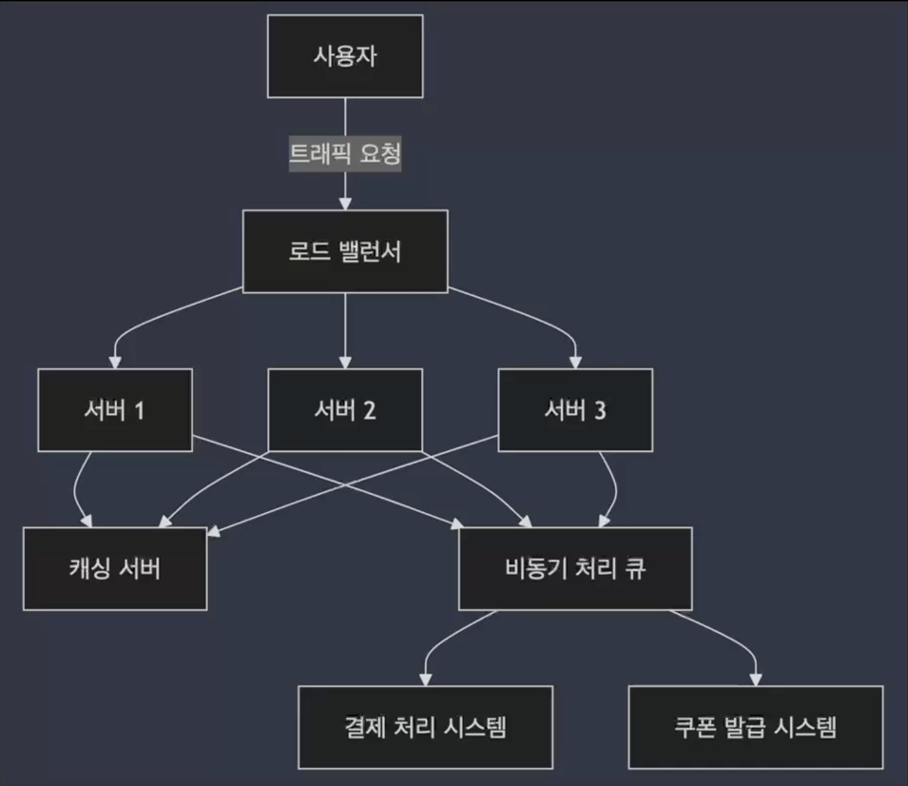
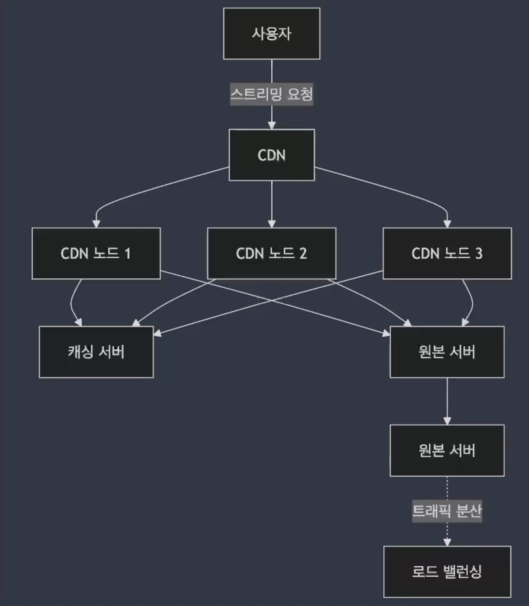
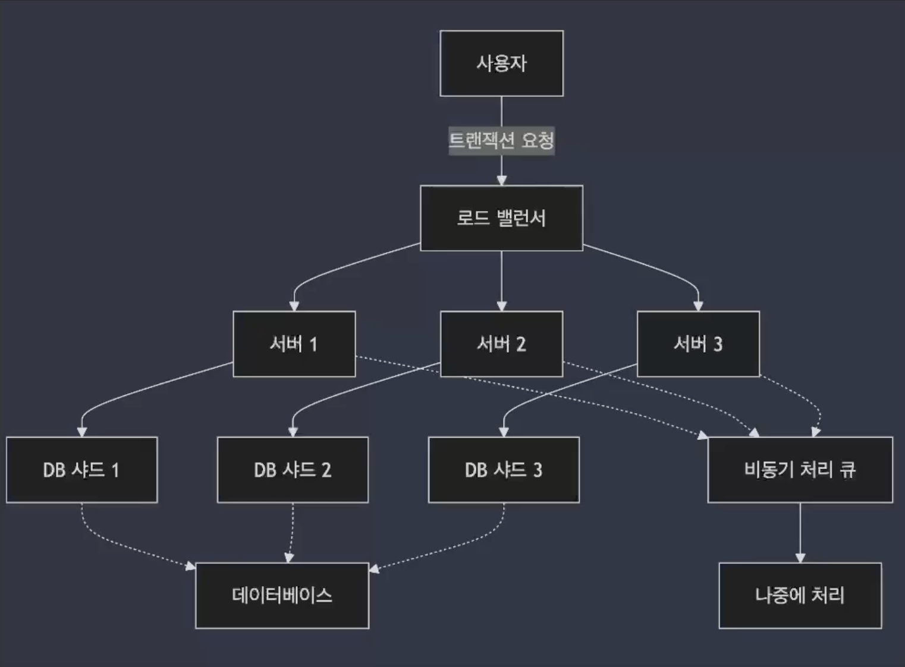

## 01. 대규모 트래픽 처리 개요

### 대규모 트래픽 발생의 주요 요인

- **마케팅 이벤트** : 대규모 할인 행사, 쿠폰 발급, 타임 세일, 새로운 상품 출시 등 이벤트로 인해 트래픽이 급증
- **바이럴 콘텐츠** : SNS, 뉴스 또는 인터넷에서 급속도로 퍼지는 콘텐츠로 인해 갑자기 트래픽 증가
- **인기 서비스** : 갑작스럽게 주목받은 애플리케이션이나 서비스는 예상보다 훨씬 많은 사용자가 동시에 접속
- **리소스 집중** : 특정 시간대에 많은 사용자가 몰려드는 경우 (예: 저녁 시간대 스트리밍 서비스).

### 대규모 트래픽 처리 실패 시의 문제점

- 성능 저하
- 시스템 다운타임
- 데이터 일관성 문제 (`ex_` 중복 주문, 재고 부족 등)
- 서버 자원 낭비

### 대규모 트래픽 처리의 필요성

- 사용자 경험 향상
- 서비스 신뢰성 보장
- 확장성과 비즈니스 성장 지원
    - 대규모 트래픽을 처리할 수 있는 아키텍처 설계 → 서비스 확장 가능
- 비용 최적화 ❗

### 트래픽 급증 대비를 위한 주요 처리 전략

- 수평적 확장 (Horizontal Scaling)
    - 트래픽이 증가할 때 **여러 서버를 추가하여 처리 능력을 확장하는 방식**
    - **각각의 서버는 동일한 역할을 수행**하며, 트래픽을 분산 처리
    - **특징**
        - 서버를 쉽게 추가하거나 제거할 수 있어 유연한 확장이 가능.
        - 장애가 발생한 서버를 제외하고도 다른 서버가 계속 요청을 처리할 수 있어 고가용성을 유지
    - **실제 적용**
        - 클라우드 환경에서의 Amazon EC2 Auto Scaling
        - Kubernetes와 같은 기술을 사용하여 자동으로 서버를 추가하거나 제거
- 부하 분산 (Load Balancing)
    - Load Balancer는 다수의 서버가 있는 환경에서 **트래픽을 균등하게 분배**하는 역할
    - **특정 서버에 부하가 집중되는 것을 방지**
    - **특징**
        - 트래픽이 많을 때도 각 서버가 안정적으로 작동하도록 보장
        - 다양한 알고리즘(라운드 로빈, 최소 연결, IP 해시 등)을 사용하여 트래픽을 분배
        - 서버 장애 시 다른 서버로 트래픽을 자동으로 전환하여 서비스 중단을 방지할 수 있음
    - **실제 적용**
        - L4를 통한 하드웨어 로드 밸런서
        - NGINX, HAProxy 같은 소프트웨어 로드 밸런서
        - Amazon Elastic Load Balancing(ELB)**과 같은 클라우드 기반 로드
- 캐싱 (Caching)
    - **자주 조회하는 데이터를 미리 저장하여 사용자 요청 시 즉시 제공하는 방식**
    - 데이터베이스나 API 요청 대신 **캐시된 데이터를 사용함으로써, 응답 시간을 줄이고 트래픽 부하를 감소**
    - **주요 특징**
        - 반복 요청에 대한 빠른 응답을 제공
        - 데이터베이스나 원본 서버의 부하를 줄여 성능 향상
        - TTL(Time to Live) 설정을 통해 캐시 데이터의 유효 기간을 관리
    - **실제 적용**
        - Redis, Memcached와 같은 인메모리 캐시 솔루션
        - CDN(Content Delivery Network)을 통해 자주 요청되는 파일(이미지, 비디오 등)을 캐싱
- 비동기 처리 (Asynchronous Processing)
    - 즉시 응답할 필요가 없는 작업(예: 이메일 발송, 로그 기록 등)은 비동기 처리를 통해 백그라운드에서 수행되며, 사용자 요청에 대한 응답은 빠르게 처리
    - **주요 특징**
        - 실시간으로 즉시 처리할 필요가 없는 작업을 비동기적으로 처리하여 메인 시스템의 부담을 감소
        - 큐를 통해 작업을 저장하고 필요한 시점에 나중에 처리
    - **실제 적용**
        - RabbitMQ, Apache Kafka, Amazon SQS와 같은 메시지 큐 시스템을 사용하여 비동기 작업을 처리
- 데이터베이스 최적화

### 대용량 트래픽 처리 기술 개요 : 데이터데이스 샤딩(Database Sharding)

- 데이터베이스의 데이터를 여러 개의 샤드(Shard)로 나누어 분산 저장하는 기술
- 한 번에 처리할 수 있는 데이터의 양을 줄이고, 데이터베이스의 부하를 분산
- **주요 특징**
    - 데이터가 샤드 단위로 분산되어, 각 샤드는 독립적으로 데이터를 처리
    - 데이터베이스 성능 병목을 해소하고, 확장성을 향상 시킴
- **실제 적용**
    - MySQL, MongoDB, Cassandra와 같은 데이터베이스에서 샤딩 기능을 제공하여 대규모 데이터 처리에 대응

### 대용량 트래픽 처리 기술 개요 : CDN (Content Delivery Network)

- CDN은 지리적으로 분산된 서버 네트워크로, 사용자가 서버와 가까운 위치에서 콘텐츠를 다운로드할 수 있도록 함
- 트래픽을 분산시키고 사용자에게 더 빠른 콘텐츠 제공을 가능하게 함
- **주요 특징**
    - 사용자가 가까운 노드에서 콘텐츠를 다운로드하여 응답 시간을 최소화
    - 원본 서버의 부하를 줄여, 대규모 트래픽을 효과적으로 처리
- **실제 적용**
    - Akamai, Cloudflare, Amazon CloudFront와 같은 CDN 서비스를 통해 정적 파일(이미지, 동영상 등)을 빠르게 제공

## 02. 대규모 트래픽 처리 사례

### 온라인 쇼핑몰의 타임 세일

- **특정 시간대에 진행되는 타임 세일은 수십만 명의 사용자가 동시에 상품을 구매하려고 접속**
- 트래픽이 폭발적으로 증가하며, 서버가 많은 사용자의 요청을 처리하지 못할 경우 성능 저하나 장애가 발생

→ 수평적 확장 : 타임세일 동안 여러대의 서버를 추가하여 트래픽 처리, 각 서버는 동일한 역할 수행 (부하 분산 처리) `ex_ AWS EC2 Auto scaling, Kubernetes(쿠버네티스)`

→ 캐싱 : 자주 조회되는 상품 정보, 이미지 파일 등 미리 캐싱에 저장 → 원본 데이터 호출 대신 캐싱 데이터 호출 (요청 부하 감소) `ex_ Redis, Memcached`

→ 로드 밸런싱 도입 : 트래픽을 각 서버에 분산시켜 특정 서버에 과부하가 걸리지 않도록 함

- 소프트웨어 로드 밸런서 : NGINX, HAProxy, Amazon Elastic Load Balancing(ELB) 등
- 하드웨어 로드 밸런서 : L4 등

→ 비동기 처리 : 결제나 쿠폰 발급 등 시간이 걸리는 작업을 주로 비동기 처리로 함 `ex_ RabbitMQ, Apache Kafka, Amazon SQS 등`

추가적으로 데이터베이스 replication을 통해서 읽기 요청이 폭주할 때 DB 인스턴스로 분산하여 성능 유지, 서버 1,2,3 앞에 Api Gateway 를 도입하여 특정 API 엔드포인트로의 트래픽을 집중관리하여 다른 API 엔드포인트까지 함께 보호하는 방법도 있음

### 스트리밍 서비스

- 스트리밍 서비스에서는 많은 사용자가 동시에 비디오를 시청하는 상황이 자주 발생
- 인기 프로그램이 신규로 공개되거나, 특정 시간대에 수천 명의 사용자가 동시에 접속할 경우 트래픽이 급증

→ CDN 적용 : 전세계의 분산된 서버에서 사용자에게 가까운 곳에서 동영상 파일이나 이미지를 전송 `ex_ Cloudflare`

→ 캐싱

→ 수평적 확장 : 트래픽 급증 대비

### 금융 서비스의 트랜잭션 처리

- 금융 시스템에서는 수많은 거래가 동시에 발생
- **특히 급증하는 트래픽 속에서 거래를 안전하게 처리하는 것이 매우 중요**
- 금융 서비스에서 데이터 **일관성, 성능, 안정성이 보장**되어야 하며, 트랜잭션이 신속하게 처리될 수 있어야 함

→ DB 샤딩 : 데이터를 여러개의 샤드로 나누어 분산 저장하는 기술, 트래픽이 몰려도 각 샤드에서 독립적으로 처리 `ex_ MongoDB, MySQL`

→ 비동기 처리 : 알림, 로그 등 비긴급 작업을 비동기로 처리

→ 로드 밸런싱 도입 : 트래픽이 급증할 때 로드밸런서가 여러 서버에 균등하게 트래픽을 분산시켜 서버 과부하 방지, 서버 중 하나가 장애를 일으키더라도 다른 서버에서 트랜잭션 처리를 할 수 있도록 하여 거래의 일관성 유지

### 대규모 트래픽 처리의 다양한 사례

- **수평적 확장 (Horizontal Scaling)** : 서버를 여러 대로 늘려 트래픽 급증에 대응하는 기본 전략
- **캐싱 (Caching)** : 자주 조회되는 데이터나 파일을 캐시에 저장하여 성능을 극대화하고 부하를 최소화
- **로드 밸런싱 (Load Balancing)** : 여러 서버에 트래픽을 분산시켜 과부하를 방지하고 안정성을 보장
- **비동기 처리 (Asynchronous Processing)** : 시간이 오래 걸리는 작업은 비동기적으로 처리하여 시스템의 응답성과 자원을 효율적으로 활용
- **데이터베이스 샤딩 (Database Sharding)** : 대규모 데이터 처리에서 성능 병목을 방지하는 핵심 기술