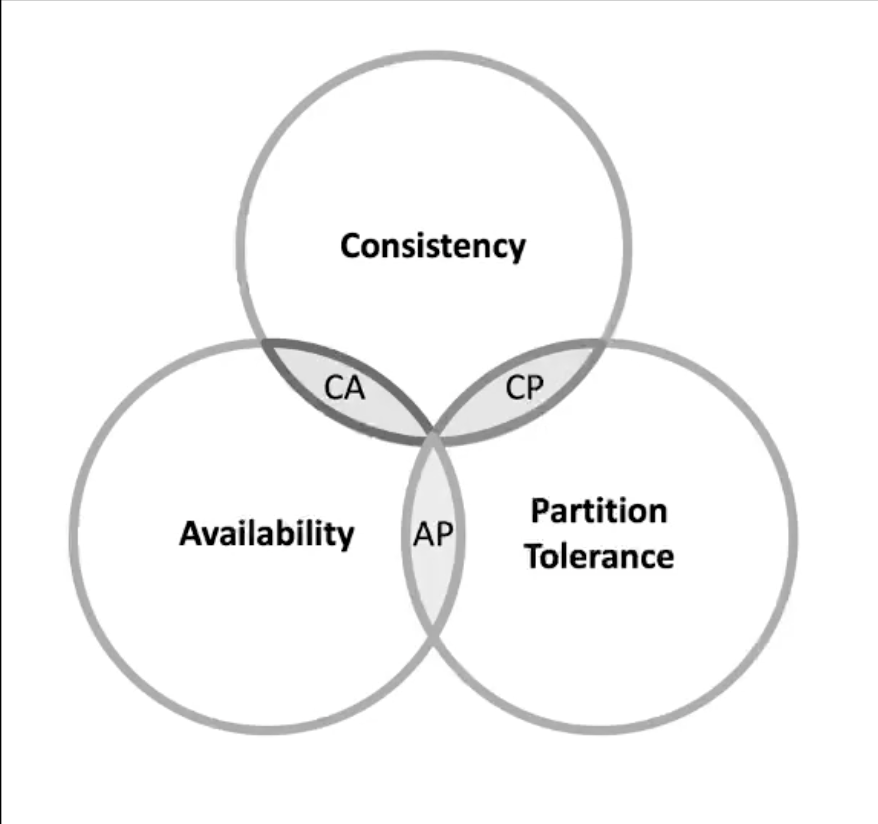
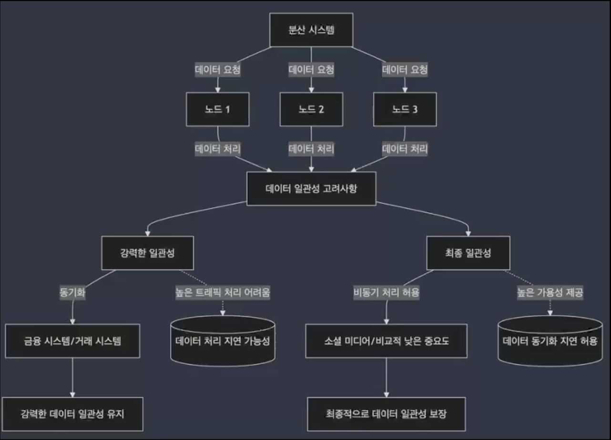
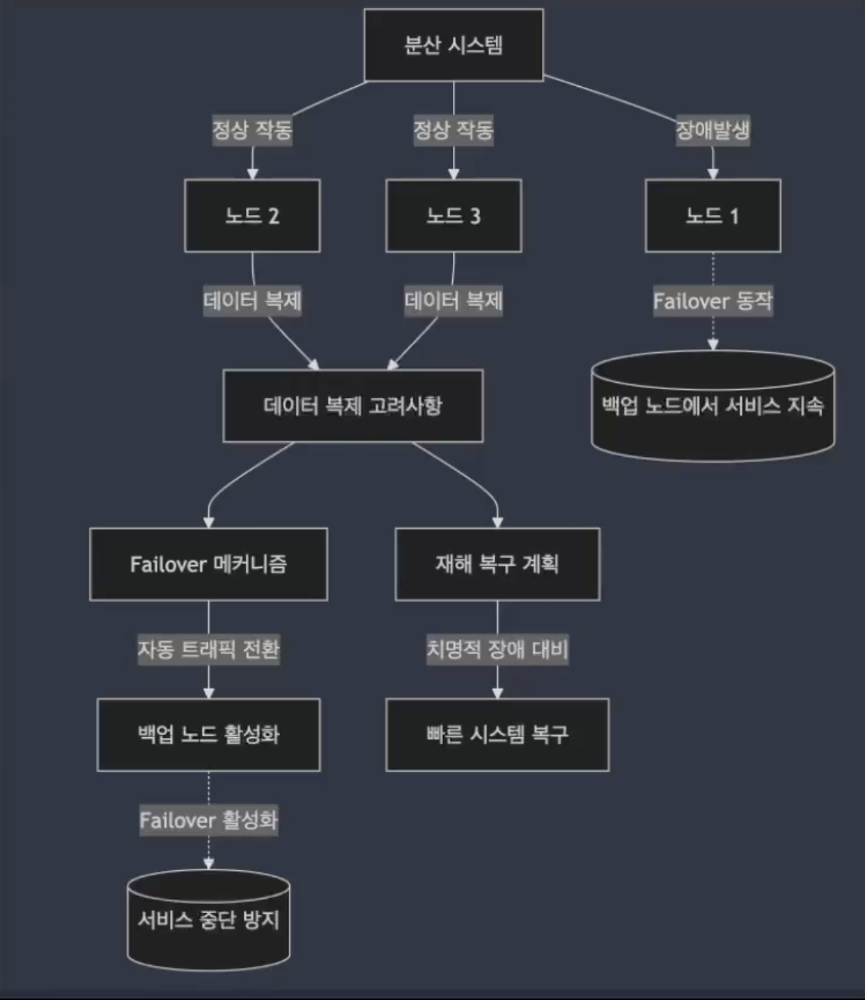
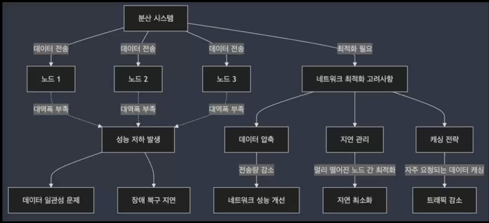

## 01. 분산 시스템의 구성 요소와 기본 원리

### 분산 시스템의 정의

- **여러 대의 컴퓨터(노드)가 네트워크를 통해 하나의 시스템처럼 동작하는 시스템**
- 각 노드는 독립적으로 동작하면서도, 시스템 전체적으로는 하나의 일관된 서비스처럼 보이도록 협력
- **확장성(Scalability)** : 트래픽이 증가해도 여러 서버를 추가하여 부하를 분산시킬 수 있음
- **성능 향상(Performance)** : 작업을 여러 노드에 분산 처리하여 시스템의 성능을 극대화할 수 있음
- **가용성(Availability)** : 여러 노드에 걸쳐 시스템이 구성되어 있기 때문에, 일부 노드가 장애를 겪더라도 시스템은 계속 운영될 수 잇음

### 분산 시스템이 왜 필요한가?

`확장성(Scalability) + 성능 향상(Performance) + 가용성(Availability)` ⇒ 여러 개의 노드가 하나의 시스템처럼 동작

### 분산 시스템의 주요 구성 요소

- **노드(Node)**
    - 분산 시스템의 기본 단위
    - 각 노드는 독립적인 컴퓨터로서, 역할에 따라 데이터 저장, 처리, 요청 관리 등을 담당
- **네트워크**
    - 분산 시스템 내의 노드 간 통신을 담당
    - 노드 간 데이터 전송과 상호작용을 관리하며, 네트워크의 성능이 분산 시스템의 성능에 큰 영향을 미침
- **데이터 복제 및 분산**
    - 데이터를 여러 노드에 복제하여 저장함으로써 가용성과 내결함성을 보장
    - 데이터가 분산되어 저장되면, 하나의 노드에 문제가 발생해도 다른 노드에서 데이터를 제공할 수 있음

### 분산 시스템의 주요 원리

- **데이터 일관성 (Consistency)**
    - 모즌 노드가 동일한 데이터 상태를 유지하는 능력
    - 하나의 노드에서 데이터가 업데이트되면, 다른 노드도 동일한 데이터를 가지게 됨
- **가용성 (Availability)**
    - 시스템이 항상 사용자 요청에 응답할 수 있는 능력
    - 하나 이상의 노드가 다운되더라도, 분산 시스템은 여전히 정상적으로 운영될 수 있어야 함
- **내결함성 (Fault Tolerance)**
    - 시스템이 일부 노드의 장애에도 불구하고 서비스를 지속할 수 있는 능력
    - 데이터 복제 및 분산, 장애 발생 시 자동 복구를 통해 내결함성을 확보할 수 있음

### CAP 이론

- CAP 이론은 분산 시스템에서 세 가지 주요 특성인
    
    **일관성(Consistency),**
    
    **가용성(Availability),**
    
    **파티션 내성(Partition Tolerance)**
    
    해당 특성은 **동시에 모두 만족시킬 수 없다**는 것을 나타냄
    
- CAP 이론은 세 가지 특성 중 두 가지를 선택할 수밖에 없음을 나타냄
    - **Consistency + Availability** : 네트워크 분할을 허용하지 않는 소규모 시스템에서 적합함
    - **Consistency + Partition Tolerance** : 데이터 일관성이 매우 중요한 시스템에서 가용성을 희생하고 일관성을 유지함
    - **Availability + Partition Tolerance** : 사용자의 요구에 항상 응답해야 하는 시스템에서 일관성을 약간 희생하고, 가용성을 높임

### CAP 이론을 고려한 설계

- 분산 시스템을 설계할 때 CAP 이론에 따른 선택이 필수적
- **일관성 중시 시스템 (Consistency Priority System) :** 금융 거래 시스템
    - 모든 거래가 일관성을 보장해야 하므로, 가용성보다 일관성이 더 중요함
    - 이 경우 네트워크 분할이 발생해도 **데이터의 정확성이 우선**시 됨
- **가용성 중시 시스템 (Availability Priority System) :** 소셜 미디어, 스트리밍 서비스
    - **빠른 응답이 필수**적이므로 일관성을 조금 희생하더라도 가용성과 네트워크 파티션 내성을 유지하는 것이 더 중요함
    - 사용자는 약간의 일관성 문제를 느끼지 못하지만, 빠른 서비스가 중요하게 작용

### CAP 이론에 따른 설계 전략

- **일관성(C)**을 중시하는 시스템은 정확성이 중요할 때 사용, 주로 금융 거래, 주문 시스템과 같은 데이터 일관성이 필수적인 경우에 적용됨
- **가용성(A)**을 중시하는 시스템은 빠른 응답이 중요한 서비스에서 사용. 소셜 미디어, 스트리밍 서비스와 같은 빠른 피드백이 요구되는 시스템에 적합함
- **파티션 내성(P)**은 분산 시스템에서 네트워크 장애가 발생해도 시스템이 안정적으로 작동할 수 있도록 하기 때문에, 거의 모든 분산 시스템에서 필수적으로 고려됨

## 02. 분산 시스템 설계 시 고려해야 할 요소와 실제 사례 분석

### 분산 시스템 설계 시 고려해야 할 주요 요소 : 데이터 일관성 (Data Consistency)

- **분산 시스템에서 여러 노드가 동일한 데이터를 유지하는 것이 일관성**
- **데이터 일관성은 특히 중요하며, 각 노드에서 데이터가 동일한 상태가 유지해야 함**
- **네트워크 지연이나 장애가 발생하면, 데이터가 비동기적으로 처리되면서 동기화 문제가 생길 수 있음**
- **고려사항:**
    - 강력한 일관성 vs 최종 일관성(Ev entually Consistent)
    - 어떤 시스템에서는 데이터의 강한 일관성을 보장해야 하고, 다른 시스템에서는 약간의 지연을 허용하면서 가용성을 높이는 방향을 선택할 수 있음

### 분산 시스템 설계 시 고려해야 할 주요 요소 : 장애 대응 (Fault Tolerance)

- **분산 시스템에서 노드가 장애를 겪더라도 전체 시스템이 무중단 운영을 유지하는 것이 중요**
- 장애에 대한 대비책이 잘 설계되지 않으면, 일부 노드의 장애가 전체 시스템 중단으로 이어질 수 있음
- **노드 장애나 네트워크 장애가 발생했을 때 데이터 손실이나 서비스 중단을 방지할 수 있어야 함**
- **고려 사항**
    - 데이터 복제 : 여러 노드에 데이터를 복제
    - Failover : 장애가 발생하면 자동으로 백업 노드로 트래픽을 전환
    - 재해 복구(Disaster Recovery) : 시스템에 치명적인 장애가 발생해도, 빠르게 복구할 수 있는 재해 복구 계획

### 분산 시스템 설계 시 고려해야 할 주요 요소 : 네트워크 대역폭

- **분산 시스템에서 노드 간의 데이터 전송 속도는 시스템 성능에 중요한 영향을 미침**
- **데이터가 자주 전송되거나 동기화되더야 하는 시스템에서 네트워크 대역폭이 부족하면 성능 저하**가 발생할 수 있음
- **네트워크 성능이 느리면, 분산 시스템에서 데이터 일관성 유지나 장애 복구에 문제가 생길 수 있음**
- **고려 사항:**
    - 네트워크 최적화 : 데이터 전송량을 최소화 (압축)
    - 지연(Latency) : 데이터 저장 시 지역성을 고려
    - 캐싱(Caching) : 네트워크 트래픽을 줄이기 위해 캐싱 전략을 활용

