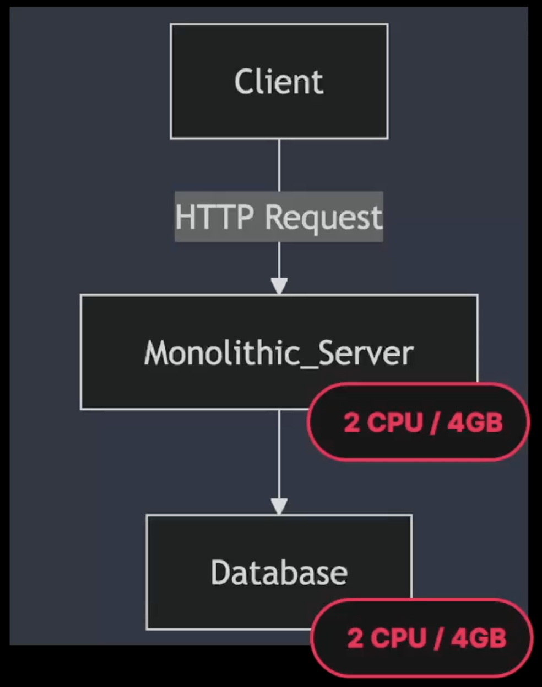
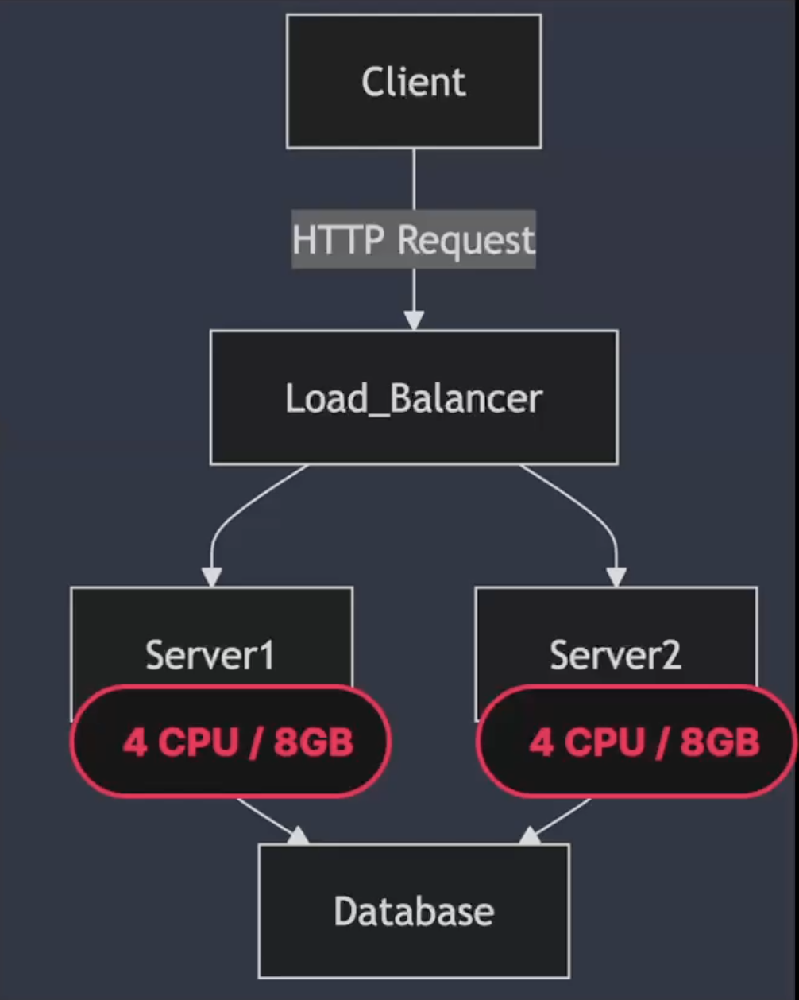
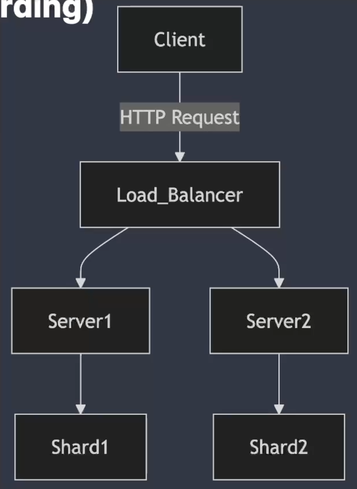
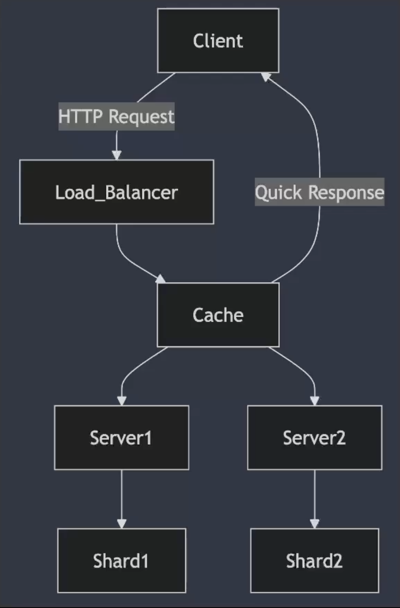
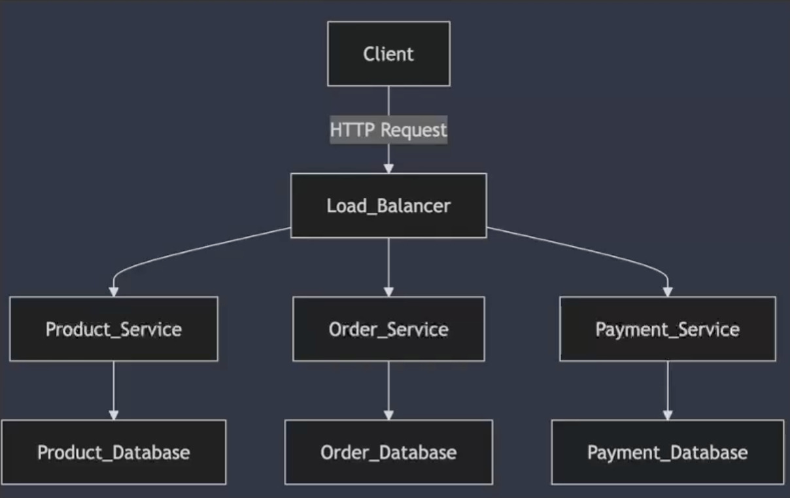
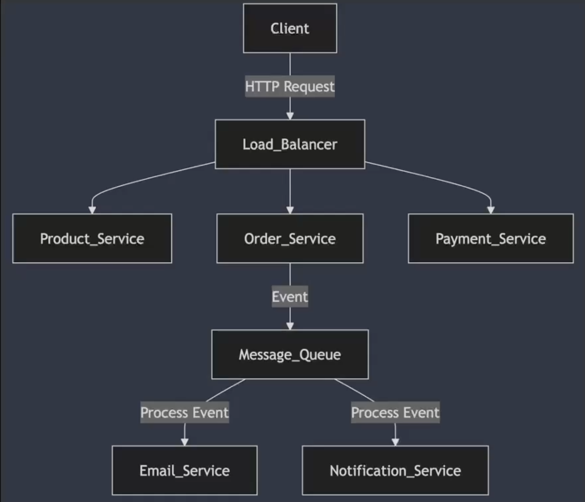

## 01. 시스템 확장의 필요성과 기본 개념

### 시스템 확장의 필요성

- **성능 저하와 사용자 증가**
- **가용성과 신뢰성**
- **비즈니스 성장과 확장성**

### 확장의 기본 개념 : 수직 확장 (Vertical Scaling)

- **기존의 서버 성능을 업그레이드하여 처리 능력을 향상시키는 방법**
- **장점**
    - **간단한 적용** : 기존 시스템을 크게 변경하지 않고도, 서버의 하드웨어 성능만 업그레이드하면 성능이 향상
    - **적은 복잡성** : 시스템 아키텍처를 변경하지 않고, 하드웨어 업그레이드로 성능을 높일 수 있어 관리가 비교적 간단
- **단점**
    - **물리적 한계** : 수직 확장은 하드웨어의 물리적 한계에 도달하면 더 이상 확장할 수 없음
    - **단일 장애 지점(Single Point of Failure)** : 한 서버에 모든 것을 집중시키면, 그 서버에 장애가 발생하면 전체 시스템이 멈출 수 있음

### 확장의 기본 개념 : 수평 확장(Horizontal Scaling)

- **수평 확장은 여러 대의 서버를 추가하여 처리 능력을 분산시키는 방식**
- **각 서버가 동일한 작업을 수행하며, 로드 밸런서를 통해 요청을 여러 서버에 분산하여 처리**
- **장점**
    - **무한한 확장성** : 이론적으로는 서버를 무한히 추가할 수 있기 때문에, 트래픽 증가에 매우 유연하게 대응할 수 있음, 대규모 시스템에서 자주 사용하는 방식
    - **고가용성** : 여러 서버로 분산된 구조이기 때문에, 하나의 서버에 문제가 발생해도 나머지 서버가 계속 운영될 수 있음. 단일 장애 지점을 제거하고, 서비스 가용성을 높이는 데 큰 역할
- **단점**
    - **복잡한 아키텍처** : 수평 확장은 서버 간 데이터 동기화나 일관성 문제를 해결해야 하는 등 복잡한 설계가 필요
    - **데이터 일관성 문제** : 여러 서버에서 동시에 데이터를 처리할 때 일관성 문제가 발생할 수 있으며, 이를 해결하기 위해 추가적인 설계나 관리가 필요

### 확장의 기본 개념 : 확장성의 주요 도전 과제

- **데이터 일관성** : 분산된 환경에서 데이터의 일관성을 유지하는 것이 어려움
- **복잡성 증가** : 여러 시스템을 연동하면서 관리와 운영이 복잡해질 수 있음
- **비용 문제** : 서버 추가 및 관리, 인프라 확장에 따른 비용 증가

## 02. 확장성을 고려한 아키텍처 설계의 실제 사례와 전략

### Monolithic한 소규모 쇼핑몰에서 대형 쇼핑몰로 발전하기

- 1단계 : Monolithic 아키텍처 (소규모 쇼핑몰)
- 2단계 : 수직 확장(Vertical Scaling) 적용
- 3단계 : 수평 확장(Horizontal Scaling) 도입
- 4단계 : 데이터베이스 분산 및 샤딩(Database Sharding)
- 5단계 : 캐싱(Caching) 적용
- 6단계 : 마이크로서비스(Microservices) 도입
- 7단계 : 비동기 이벤트 처리 도입

### 1단계 : Monolithic 아키텍처 (소규모 쇼핑몰)

- 소규모 쇼핑몰은 Monolithic 구조로 시작
- 모든 기능(상품 관리, 주문 처리, 결제 시스템 등)이 하나의 코드베이스에 포함되어 실행
- **장점** : 개발이 쉽고, 초기 리소스가 적게 들어가며 유지보수가 간편
- **단점** : 트래픽이 적을 때는 괜찮지만, 사용자가 증가할수록 시스템 성능이 떨어짐

### 2단계 : 수직 확장(Vertical Scaling) 적용

- **성능 업그레이드**
    - 더 많은 트래픽을 처리하기 위해 기존 서버의 CPU나 메모리, 디스크 용량 등을 업그레이드
    - 더 빠른 CPU나 더 많은 RAM을 추가하여 사용자 요청을 처리
- **한계점**
    - 수직적 확장에는 물리적 한계가 있기 때문에, 트래픽 증가가 계속되면 서버 성능을 더 이상 업그레이드할 수 없음
    - **성능 개선의 한계가 도달한 이후에는 시스템이 더 이상 트래픽을 감당하지 못하게 됨**

### 3단계: 수평 확장(Horizontal Scaling) 도입

- **다중 서버 구조로 전환**
    - 트래픽과 데이터의 지속적인 증가로 인해 여러 대의 서버로 트래픽을 분산시키는 수평 확장이 필요해짐
    - 로드 밸런서를 사용해 사용자 요청을 여러 대의 서버로 분산하여 처리
- **장점**
    - 트래픽에 따라 서버를 유연하게 추가할 수 있어 확장성을 제공
    - 서버가 여러 대로 분산되기 때문에, 하나의 서버가 장애가 나도 다른 서버가 계속 운영되어 가용성을 높일 수 있음

### 4단계: 데이터베이스 분산 및 샤딩(Database Sharding)

- **데이터베이스 성능 한계**
    - 수평적 확장을 통해 서버가 분산되었지만, 데이터베이스가 병목 현상을 일으키기 시작
    - 데이터베이스는 한 대에서 모든 트랜잭션을 처리하기 때문에 성능 저하가 발생할 수 있음
- **샤딩 도입**
    - 데이터를 여러 개의 샤드(Shard)로 분리하여, 각 샤드가 독립적으로 데이터를 처리

### 5단계: 캐싱(Caching) 적용

- **자주 사용되는 데이터 최적화**
    - 대규모 사용자가 동시에 접속할 때, 자주 조회되는 데이터를 데이터베이스에서 매번 조회하는 대신, 캐시에 저장해 빠르게 응답
    - Redis, Memcached 같은 캐시 시스템을 사용하여 데이터베이스 부하를 줄이고 응답 시간을 단축
- **적용 효과**
    - 캐싱을 통해 데이터베이스에 대한 요청이 크게 줄어들고, 사용자에게 더 빠른 응답
    - 특히, 트래픽이 폭증하는 이벤트나 프로모션 기간에 큰 도움

### 6단계: 마이크로서비스(Microservices) 도입

- **Monolithic 구조의 한계**
    - 쇼핑몰이 더 커지면서 Monolithic 구조는 너무 복잡해지고, 기능별로 독립적인 확장과 배포가 어려워 짐
- **마이크로서비스로 전환:**
    - 각 기능을 독립적인 마이크로서비스로 분리하여 운영
    - 상품 관리, 주문 처리, 결제 시스템 등을 각각 별도의 서비스로 분리하고, 이들 간의 통신은 API를 통해 이루어짐
- **장점:**
    - 각 서비스가 독립적으로 배포, 확장될 수 있어 유연성이 증가
    - 특정 기능에 트래픽이 몰릴 경우, 해당 기능만 확장

### 7단계: 비동기 이벤트 처리 도입

- **비동기 이벤트 처리 도입**
    - 특정 작업(예: 주문 완료 시 이메일 발송, 알림 전송)이 실시간으로 처리되지 않고 비동기적으로 처리
    - 주요 트랜잭션이 완료된 후 시간이 오래 걸리는 작업은 메시지 큐로 전달되어 처리
- **장점**
    - 비동기 처리로 인해 메인 프로세스의 성능을 유지하면서, 시간이 걸리는 작업은 나중에 처리할 수 있어 응답성을 높이고 시스템을 효율적으로 운영

### 확장성과 시스템 아키텍처의 적정성 : 오버엔지니어링을 피해야 하는 이유

- **불필요한 복잡성 증가**
    - 처음부터 마이크로서비스나 비동기 처리 같은 복잡한 구조를 적용하면, 트래픽이 적은 시점에서는 관리와 운영이 과도하게 복잡해질 수 있음
    - 이는 시스템의 성능을 보장하기보다는 오히려 개발과 배포 속도를 늦추고, 개발 리소스를 낭비하게 만듦
- **비용과 리소스 낭비**
    - 초기에는 트래픽이 크지 않기 때문에, MSA나 비동기 처리를 적용하는 데 필요한 인프라 비용과 개발 시간이 낭비될 수 있음
    - 작은 팀이나 빠른 서비스 출시가 중요한 상황에서는 불필요한 투자가 될 수 있음

### 확장성과 시스템 아키텍처의 적정성 : 시스템 상태에 맞는 구조 선택의 중요성

- **단계적 확장**
    - 처음에는 Monolithic 구조로 시작하여, **트래픽 증가나 비즈니스 확장에 따라 점차 수평 확장, 데이터베이스 샤딩, 캐싱, 마이크로서비스 등으로 전환하는 것이 일반적인 권장 방식**
    - 즉, 현재 시스템의 상태와 트래픽 요구에 맞는 확장 전략을 선택
- **필요에 따라 확장**
    - 서비스가 성장하고 트래픽이 증가할 때, 그에 맞춰 필요한 부분만 비동기 처리로 전환하거나, 특정 기능만 마이크로서비스로 분리하는 것이 좋음
    - 시스템의 유연성을 유지하면서도 불필요한 복잡성을 최소화

### 확장성과 시스템 아키텍처의 적정성 : 적절한 시점에서의 아키텍처 전환

- **지나친 최적화 경계**
    - 초기에 지나친 아키텍처 최적화를 시도하면, 나중에 변경이나 수정이 어려워질 수 있음
    - 기술 부채를 최소화하고, 서비스 요구에 맞춰 단계별로 적절한 시점에서 아키텍처를 전환하는 것이 중요
- **트래픽 급증 대응**
    - 사용자가 폭발적으로 증가하거나 트래픽이 급증할 경우에만 수평 확장과 마이크로서비스를 도입하여 시스템을 확장하는 것이 효율적