## 01. Redis의 기본 개념

### Redis란 무엇인가

- **Remote Dictionary Server”의 약자로, 메모리 기반의 고성능 데이터 저장소**
- 주로 캐시, 메시지 브로커, 세션 저장소로 사용
- Key-Value 구조와 다양한 데이터 타입 지원

### Redis 사용 사례

- **캐시**
    - 자주 조회되는 데이터를 메모리에 저장해 빠르게 응답
    - 대형 쇼핑몰에서 상품 목록을 캐시하여, 데이터베이스 조회를 줄이고 사용자에게 즉시 응답 제공
        
        → 트래픽이 급증하는 쇼핑몰 세일 기간에 유용
        
    
    👇 redis의 커맨드
    
    - `SET product:12345”{name: ‘Laptop’, price: 1000, stock: 50}”`
    - `GET product:12345`
- **세션 저장소**
    - 세션 관리에 적합
    - 로그인 상태 유지 및 쇼핑 카트 정보 저장
    - 전자상거래 사이트에서 사용자의 로그인 세션과 장바구니 정보를 Redis에 저장하여 빠른 액세스 제공(레디스는 메모리 기반으로 빠른 접근 속도를 제공)
        
        → 레디스는 TTL 기능이 있어 해당 설정을 통해 세션 정보를 자동으로 만료 ⇒ 사용자가 로그아웃하거나 일정 시간이 지나면 자동으로 세션 삭제
        
        → 사용자가 상품을 장바구니에 담을 때마다 레디스에 장바구니 데이터를 저장할 수 있음
        
    
    👇 redis의 커맨드
    
    - `SET session:12345 “{user: ‘john_doe’, cart:[]}”`
    - `GET session:12345`

### Redis의 주요 특징 : 메모리 기반

- **Redis는 메모리 기반으로 동작**
- 디스크 I/O에 비해 훨씬 빠른 속도로 데이터를 읽고 쓰기 가능
- Redis가 주로 실시간 데이터 처리 및 고속 캐싱 솔루션으로 사용되는 주요 이유 중 하나

### Redis의 주요 특징 : 영속성 옵션

- **Redis는 데이터를 메모리에 저장하면서도, 영속성을 보장하기 위한 옵션을 제공**
- **RDB (Redis Database) 스냅샷** : 주기적으로 전체 데이터를 디스크에 저장
- **AOF (Append-Only File)** : 데이터 변경 로그를 저장해 시스템 재시작 시 복구 가능
- 이 영속성 옵션을 통해 데이터 손실을 최소화하고 시스템 장애 시 데이터를 복구할 수 있음

### Redis의 주요 특징 : 다양한 데이터 타입

- **String** : 가장 기본적인 Key-Value 타입으로, 문자열, 숫자 등의 데이터 저장
- **List** : 순서가 있는 데이터의 목록으로, 삽입 및 삭제가 O(1) 시간 복잡도로 가능
- **Set** : 중복 없는 데이터의 집합으로, 집합 연산(교집합, 차집합 등)을 빠르게 수행
- **Sorted Set(ZSet)** : 점수를 기준으로 정렬된 집합. 순위, 리더보드 등의 구현에 유용
- **Hash** : 필드-값 쌍으로 구성된 Key-Value의 집합. 복잡한 객체를 저장할 때 유용
- **Bitmaps** : 비트 값을 저장하며, 비트 연산을 빠르게 수행
- **HyperLogLog** : 메모리를 거의 사용하지 않으면서 고유 값의 개수를 추정하는 데이터 구조
    
    → 대규모 중복 데이터를 검출, 사용자 활동 분석하는데 사용
    

### Redis의 주요 특징 : 복제 (Replication)

- Redis는 **Master-Slave 복제 구조를 지원하여 데이터 가용성을 높이고, 읽기 부하를 분산할 수 있음**
- Master는 데이터를 쓰고, Slave는 데이터를 읽는 구조로, 읽기 성능 향상 및 데이터 백업을 제공

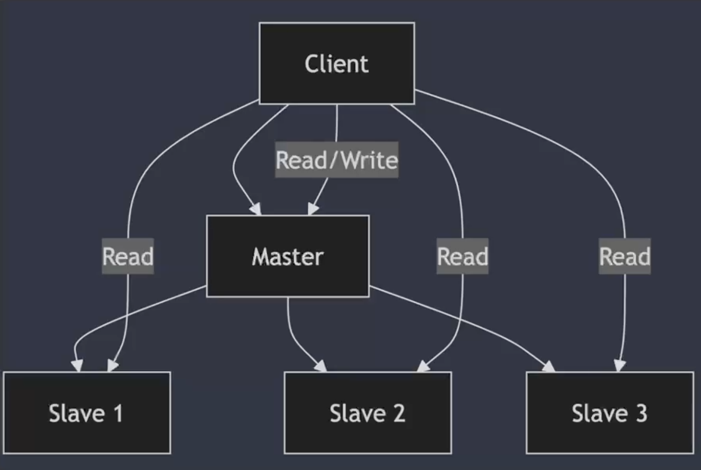

### Redis의 주요 특징 : 고가용성

- Redis는 Sentinel이라는 기능을 통해 자동 복구 및 장애 조치(Failover)를 지원
- Sentinel은 Redis 인스턴스를 모니터링하고 **Master 노드에 장애가 발생하면 자동으로 Slave 노드를 승격하여 서비스의 중단 없이 운영**

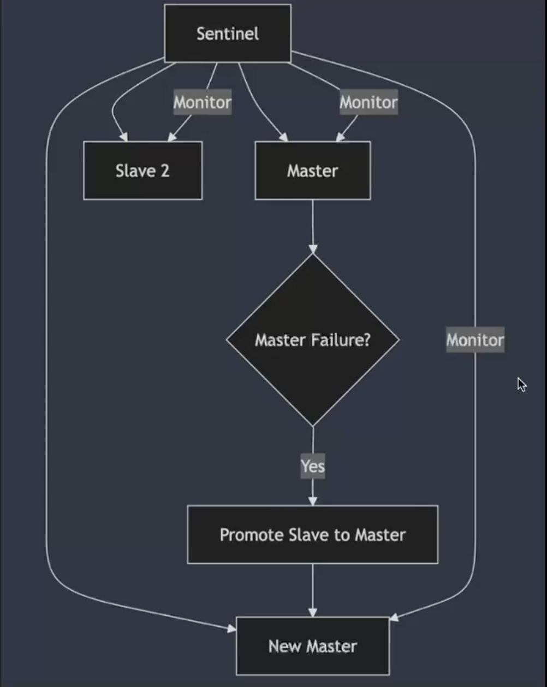

### Redis의 주요 특징 : 클러스터링

- Redis는 Cluster 기능을 통해 데이터를 여러 노드에 분산 저장하고, 수평적 확장성을 제공
- **대규모 데이터를 다루는 환경에서도 성능 저하 없이 확장이 가능**
- **클러스터는 자동으로 데이터를 노드 간 분산시키며, 각 노드는 해시 슬롯을 통해 데이터를 관리**

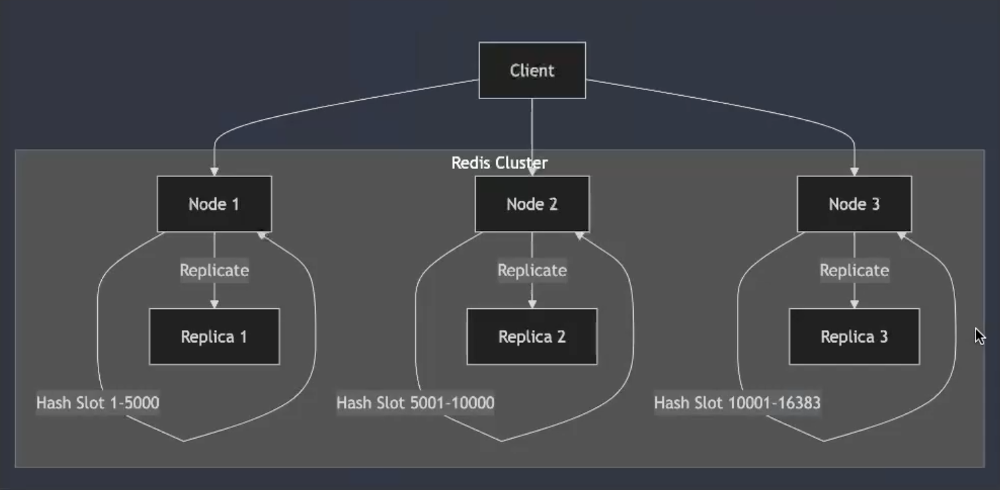

### Redis 아키텍처 개요 : 싱글 스레드 모델

- Redis는 싱글 스레드로 동작하며, 하나의 요청을 한 번에 처리
- **I/O 성능을 극대화하는 구조로 설계되어, 여러 요청을 매우 빠르게 처리할 수 있음**
- 싱글 스레드 모델 덕분에 락 경합이 없고, 프로세스가 경량화되어 성능 저하 없이 빠르게 동작

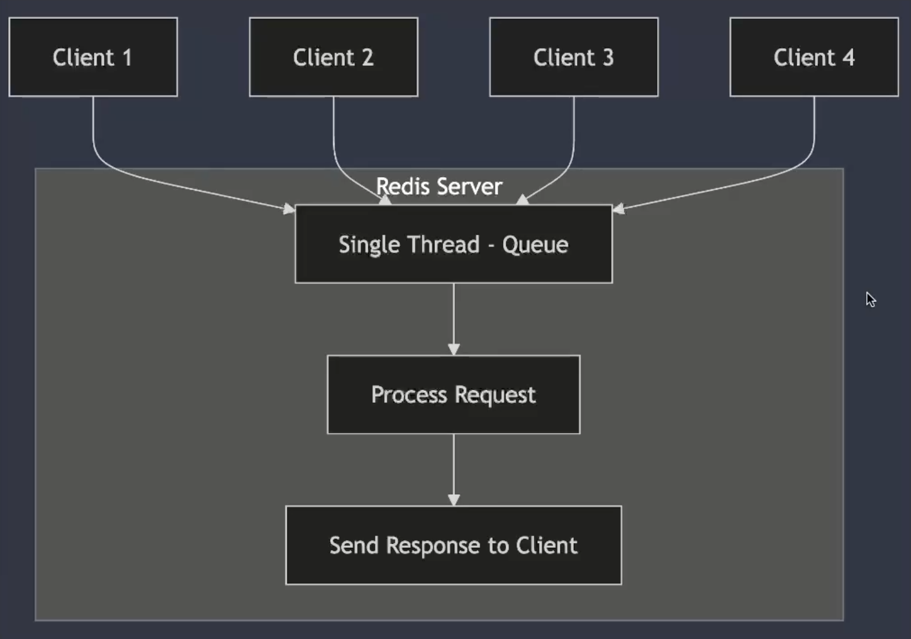

### Redis 아키텍처 개요 : 비동기 I/O

- Redis는 **비동기 I/O 모델을 채택하여, 네트워크 요청이나 파일 쓰기와 같은 I/O 작업을 논블로킹(non-blocking)으로 처리**
- 이로 인해 네트워크 대기 시간을 줄이고, 많은 요청을 동시에 처리하는 데 있어 높은 성능을 발휘

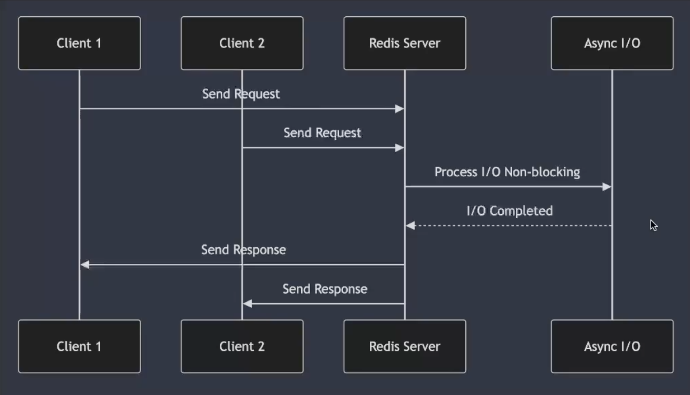

### Redis 아키텍처 개요 : 데이터 영속성

- Redis는 데이터 영속성을 보장하기 위한 두 가지 메커니즘을 제공
- **RDB 스냅샷**
    - 일정 간격으로 데이터베이스의 상태를 스냅샷으로 저장 (dump.rdb)
    - 주기적인 저장을 통해 데이터를 복구할 수 있음
- **AOF 로그**
    - 데이터 변경 사항을 지속적으로 기록하며, Redis가 재시작될 때 모든 변경 사항을 복구할 수 있음
    
    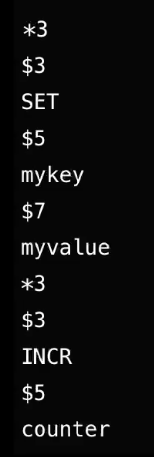
    

## 02. Redis 데이터 타입 및 사용 사례

### Redis의 주요 데이터 타입 : String

- Redis에서 가장 기본적인 데이터 타입으로, 단순한 Key-Value 쌍의 구조
- 문자열, 숫자, 바이너리 데이터를 저장할 수 있음
- **주요 명령어** : SET, GET, INCR, DECR, APPEND
- **사용 사례:**
    - 캐시 데이터 : 자주 엑세스하는 데이터, 예를 들어 상품 목록이나 사용자 프로필 정보를 빠르게 제공하기 위해 String 타입을 사용하여 캐시로 저장
    - 세션 정보 저장 : 웹 애플리케이션에서 로그인한 사용자의 세션을 저장하고 조회하는 데 사용된다.
    - 카운터 : String 타입은 숫자 데이터를 저장할 수 있기 때문에 조회수, 좋아요 수와 같은 카운터 데이터를 처리하는데 적합

### Redis의 주요 데이터 타입 : String

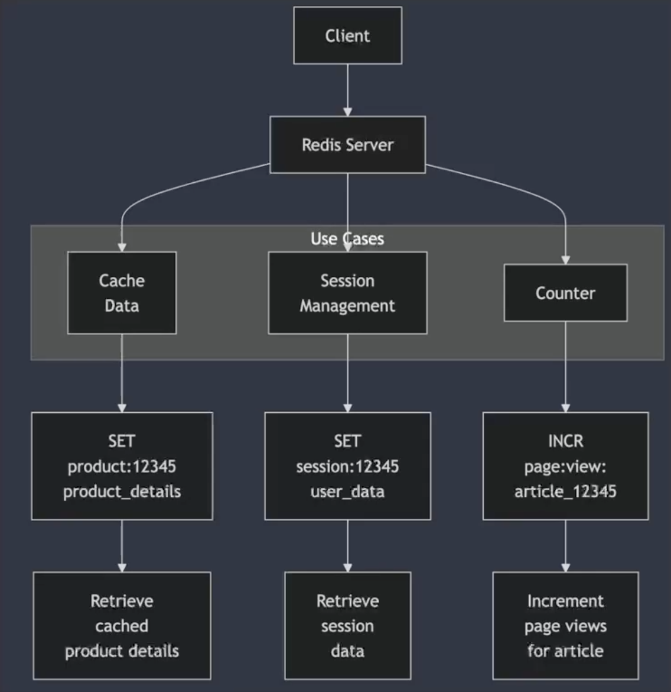

- Cache Data : 자주 엑세스 되는 데이터(상품 목록, 사용자 프로필 등)를 캐시로 저장하는 예시
- Session Management : 세션 정보를 저장하는 예시
- Counter : INCR 명령어 사용

### Redis의 주요 데이터 타입 : List

- 순서가 있는 데이터 목록으로, 삽입 및 삭제가 O(1) 시간 복잡도를 가짐
- 데이터는 앞에서 삽입하거나 뒤에서 삽입할 수 있음
- **주요 명령어** : LPUSH, RPUSH, LPOP, RPOP, LRANGE
- **사용 사례** :
    - 메시지 큐 : List는 FIFO(First-In-First-Out) 큐 또는 LIFO(Last-In-First-Out) 스택을 구현할 때 적합.
    - 타임라인 데이터 : 소셜 미디어에서 사용자의 활동 내역을 시간순으로 저장하고 보여주는 데 유용.

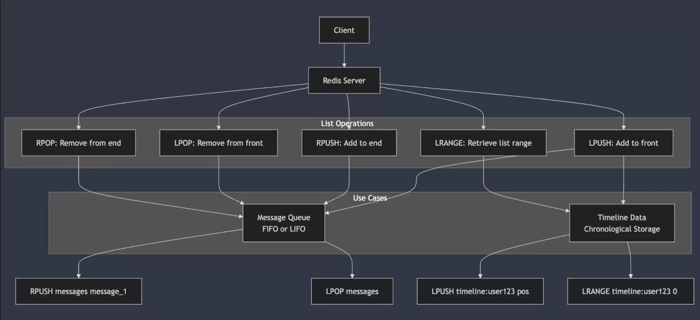

- RPOP으로 첫번째 메시지를 가져옴
- RPUSH로 사용자의 활동 내역을 저장
- LRANGE로 Timeline Data 조회

### Redis의 주요 데이터 타입 : Set

- 중복 없는 데이터의 집합을 저장한다. Set 연산(교집합, 차집합, 합집합)을 효율적으로 처리할 수 있음
- 주요 명령어 : SADD, SREM, SISMEMBER, SINTER, SUNION
- 사용 사례:
    - 태그 저장 : Set은 중복된 태그를 방지하고, 데이터의 교집합을 처리할 수 있어 태그 시스템에 적합
    - 친구 목록 : 소셜 네트워크에서 친구 관계를 저장할 때 유용함. 두 사용자 간의 공통 친구나 차집합 연산을 쉽게 처리할 수 있음

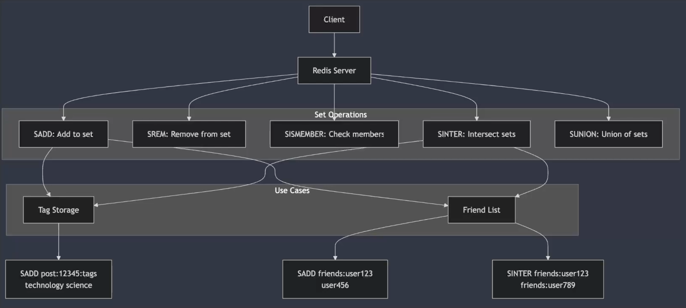

→ 태그 저장소로 사용

### Redis의 주요 데이터 타입 : Sorted Set (ZSet)

- Set과 유사하지만, 점수(score) 값을 함께 저장하며, 점수를 기준으로 데이터를 정렬할 수 있음
- **주요 명령어** : ZADD, ZRANGE, ZRANK, ZREM
- **사용 사례** :
    - 리더보드 : Sorted Set은 점수를 기준으로 정렬된 데이터에 적합하여 게임 리더보드와 같은 순위 시스템을 구축하는 데 매우 유용함
    - 이벤트 우선순위 처리 : 이벤트나 작업을 우선순위에 따라 처리하는 시스템을 구현할 때 유용함

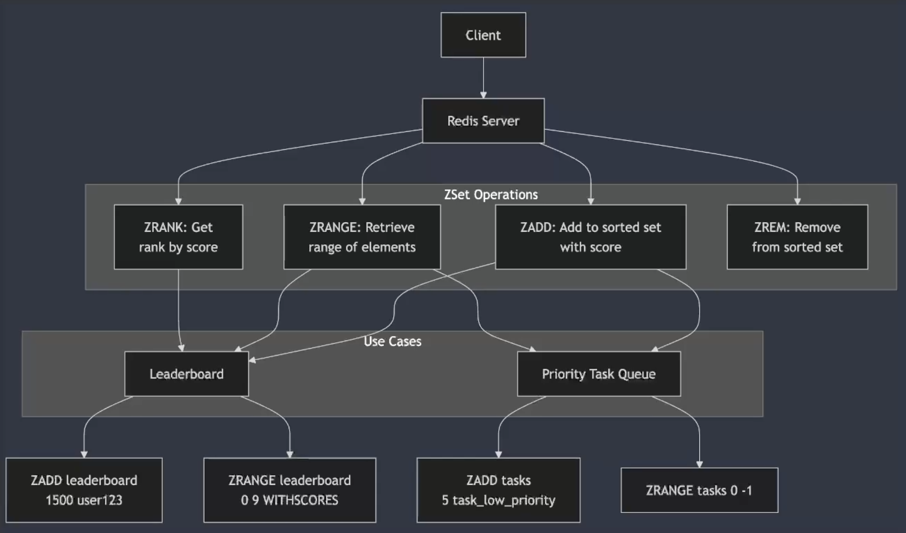

→ Priority Task Queue에서는 이벤트나 작업을 우선순위 시스템에 따라 처리하는 시스템에 유용

### Redis의 주요 데이터 타입 : Hash

- 필드와 값을 쌍으로 저장하는 데이터 구조로, 복잡한 객체를 저장할 때 유용함
- **주요 명령어** : HSET, HGET, HGETALL, HDEL
- **사용 사례** :
    - 사용자 프로필 정보 : 하나의 키에 대해 여러 필드를 저장할 수 있어 사용자 데이터를 효율적으로 관리할 수 있음
    - 설정 저장 : 어플리케이션의 구성 설정을 Hash로 저장하여 필드별로 빠르게 접근 가능함

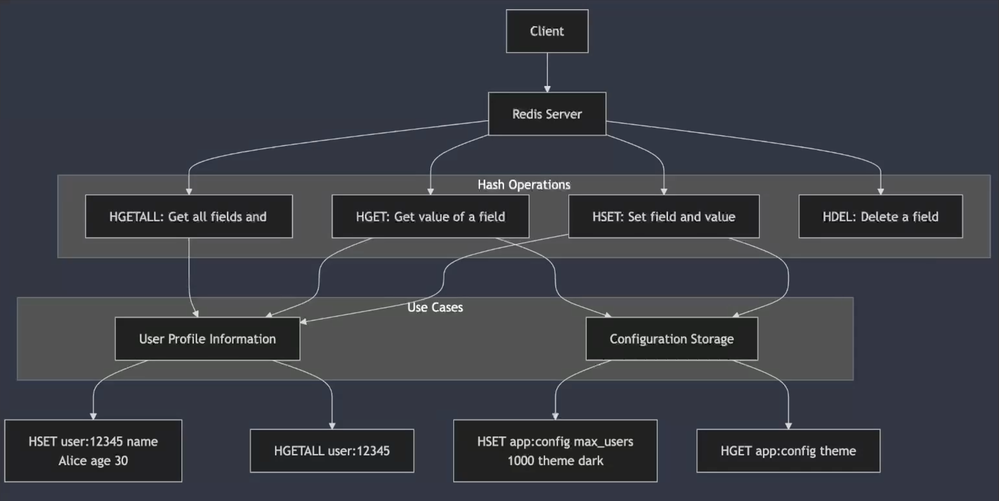

### Redis의 주요 데이터 타입 : Bitmaps

- 비트 값을 저장하며, 비트 연산을 효율적으로 수행할 수 있음
- **주요 명령어** : SETBIT, GETBIT, BITCOUNT
- **사용 사례** :
    - 로그인 상태 체크 : Bitmaps는 사용자 로그인 여부와 같은 상태 정보를 저장하는 데 적합
    - 이벤트 기록 : 특정 시간 동안 이벤트 발생 여부를 효율적으로 기록할 수 있음

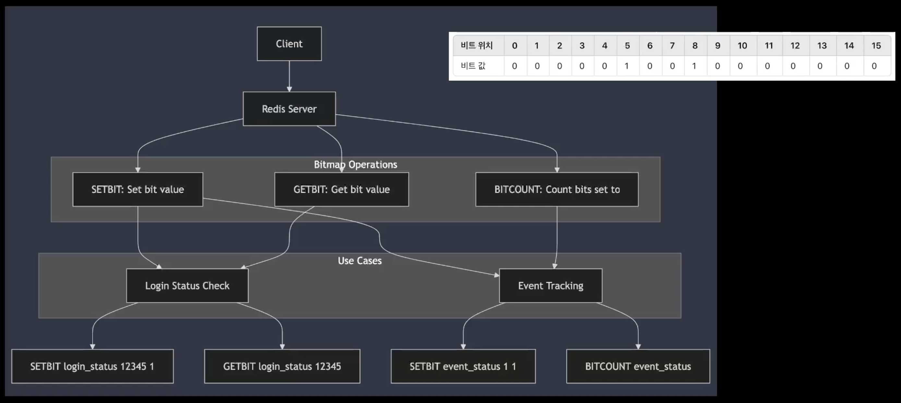

### Redis의 주요 데이터 타입 : HyperLogLog

- 고유 값의 개수를 메모리를 거의 사용하지 않고 추정하는 데이터 구조 (중복된 항목을 추정하여 고유 값만 추정)
    
    → 내부적으로 HyperLogLog는 해시함수와 BitVector를 사용해서 bit 패턴을 기록하는 형태
    
    → 입력된 고유값들은 해시함수에 의해 변환된 후 BitVector에서 특정한 위치에 해당되는 bit들이 설정 ⇒ 여기서 설정된 bit 값들을 이용해 추정
    
- 정확한 값이 아닌 근사치를 제공하지만, 매우 적은 메모리로 대규모 데이터의 중복을 계산할 수 있음
- **주요 명령어** : PFADD, PFCOUNT, PFMERGE
- **사용 사례** :
    - 대규모 중복 데이터 검출 : HyperLogLog는 매우 적은 메모리로 대규모 데이터셋에서 중복을 제거하고 고유 항목의 수를 계산하는 데 유용함
    - 사용자 활동 분석 : HyperLogLog는 많은 사용자 데이터를 분석하고 중복 데이터를 처리할 때 유용함

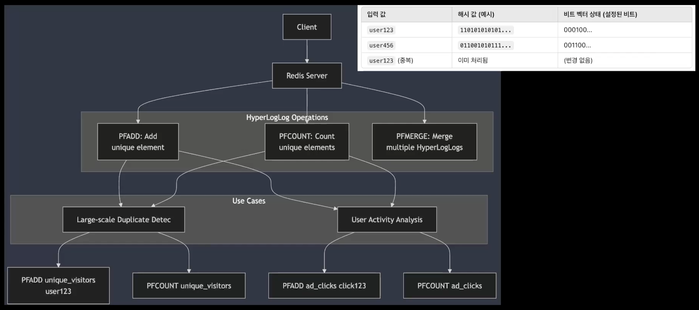

→ PFADD : 고유값을 HyperLogLog에 추가

→ PFCOUNT : HyperLogLog에 저장된 고유값의 근사치를 계산

→ PFMERGE : 여러 HyperLogLog를 병합하여 고유값의 근사치를 계산

### 정리 : 각 데이터 타입의 사용 사례

- **String** : 간단한 캐시, 상태 정보 저장에 사용
- **List** : FIFO(First-In-First-Out) 큐 또는 LIFO(Last-In-First-Out) 스택 구현
- **Set** : 대규모 데이터에서 중복 제거 및 집합 연산을 바르게 처리
- **Sorted Set** : 랭킹이나 우선순위가 중요한 시스템 구현에 적합
- **Hash** : 작은 객체를 필드별로 효율적으로 저장하고 조회
- **Bitmaps** : 상태 체크나 비트 연산이 필요한 경우 사용
- **HyperLogLog** : 매우 적은 메모리로 유니크 데이터 수 추정에 유용

## 03. Redis의 고급 기능 및 성능 최적화

### Redis의 고급 기능

- Redis Cluster
- Redis Sentinel
- Pub/Seb 시스템
- Lua 스크립트
- Pipelining

### Redis의 고급 기능 : Redis Cluster

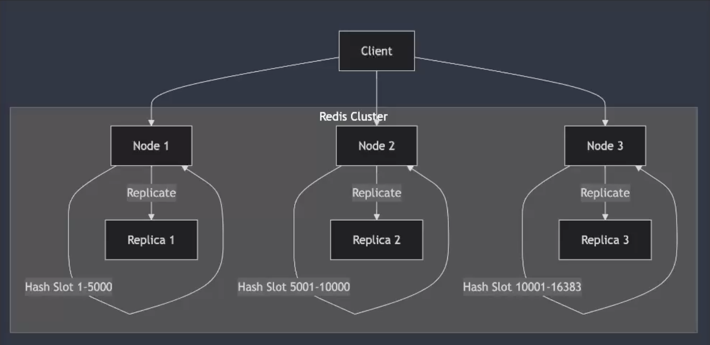

- **수평적 확장성 제공**
    - 여러 노드에 데이터를 분산 저장
    - 이 기능은 대규모 데이터를 처리하는 데 매우 유용하며, 클러스터의 각 노드가 일부 데이터를 관리하게 함으로써 확장성을 보장
    - 단일 노드에만 데이터를 저장하는 전통적인 방식과 달리, Redis Cluster는 노트 추가로 시스템의 성능과 용량을 쉽게 확장할 수 있음
- **데이터 파티셔닝**
    - 데이터 파티셔닝을 사용하여 데이터를 여러 노드에 분산 저장
    - 파티셔닝은 데이터를 해시 슬록(Hash Slot)이라는 개념을 통해 분배하며, 각 노드는 해시 슬롯의 일부를 관리
    - 클러스터는 **총 16384개의 해시 슬롯을 사용**
    - 키를 해시 함수로 계산하고 그 값을 기반으로 적절한 노드에 데이터를 저장
    - 대규모 데이터셋을 효율적으로 관리할 수 있게 함

### Redis의 고급 기능 : Redis Sentinel

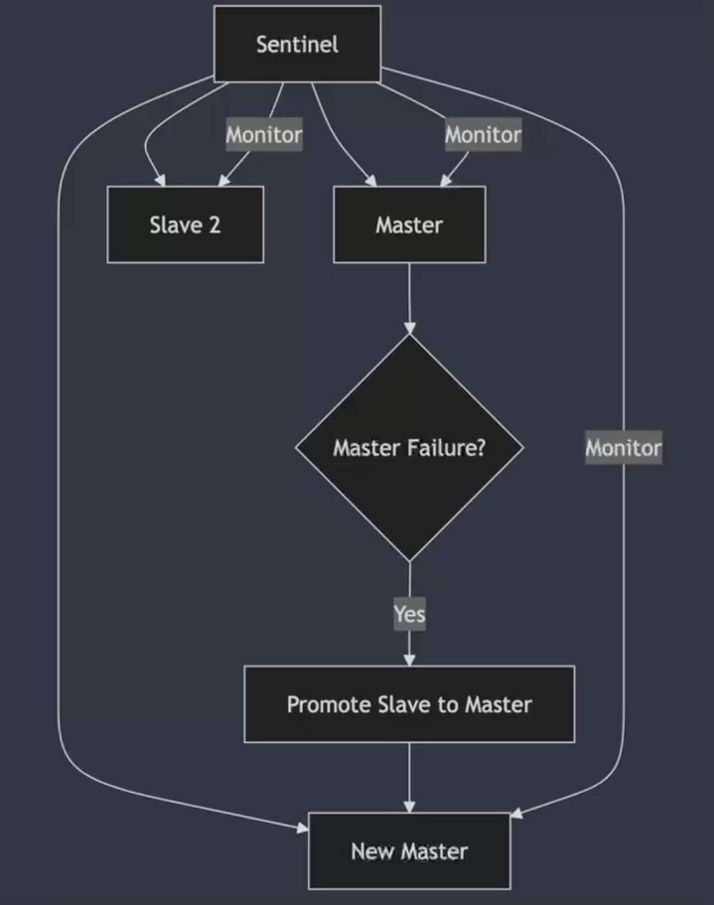

- **자동 장애 복구 및 모니터링**
    - Redis Sentinel은 자동 장애 복구 기능을 제공하여 Redis 시스템의 고가용성을 보장
    - Redis 인스턴스를 모니터링하고, Master 노드에 장애가 발생하면 자동으로 Slave 노드를 승격하여 서비스가 중단되지 않도록 함
- **고가용성 구현**
    - Redis는 Master-Slave 구조를 통해 데이터를 복제
    - Sentinel은 Master 노드가 장애를 일으킬 경우, 자동으로 Failover(장애 조치)를 실행하여 Slave 노드를 Master로 승격하여 전체 클러스터의 가용성을 유지
    - 데이터 손실을 최소화하고 서비스 다운타임을 줄일 수 있음

### Redis의 고급 기능 : Pub/Sub 시스템

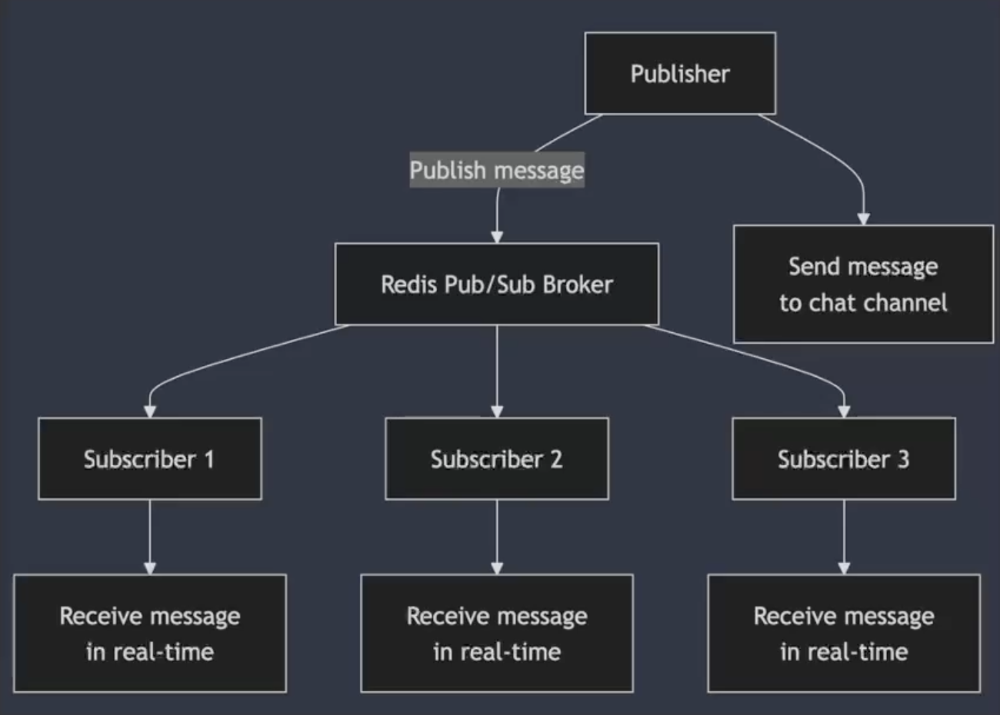

- **실시간 메시징 서비스 구현:**
    - Pub/Sub (Publish/Subscribe) 시스템은 실시간 데이터 처리를 위한 메시징 시스템
    - 발행자(Publisher)가 메시지를 전송하면, 구독자(Subscriber)는 이를 실시간으로 수신
    - 실시간 데이터 스트리밍, 이벤트 처리, 알림 시스템에 적합
- **메시지 브로커 역할:**
    - Pub/Sub 시스템은 메시지 브로커로서 데이터를 전달
    - 발행자는 주에(Topic)를 기반으로 메시지를 보내고, 구독자는 해당 주제를 구독하여 실시간으로 데이터를 수신

### Redis의 고급 기능 : Lua 스크립트

```lua
local product_key = KEYS[1]
local stock_keu = KEYS[2]
local notification_key = KEYS[3]
local quantity_to_decrease = tonumber(ARGV[1])
local user_id = ARGV[2]

-- 현재 재고 확인
local current_stock = tonumber(resud.call('GET', stock_key))

-- 재고가 부족한지 확인
if current_stock == nil or current_stock < quantity_to_decrease then
        return {err = "Insufficient stock"}
end

-- 재고 감소
redis.call('DECRBY', stock_key, quantity_to_decrease)

-- 알림 메시지 생성
local message = "Product " .. product_key .. " stock decreased by " .. quantity_to_decrease .. " for user " .. user_id

-- 사용자에게 알림 전송 (리스트에 메시지 추가)
redis.call('RPUSH', notification_key, message)

-- 작업 완료 메시지 반환
return {ok = "Transaction successful. Remining stock: " ... {current_stock - quantity_to_decrease)}
```

```bash
// Lua 스크립트 실행 방법
EVAL "<Lua Script>" <Number of Keys> <Key1><Key2> ... <Arg1><Arg2> ...
```

- **원자적 트랜잭션 및 복잡한 로직 처리**
    - Redis는 Lua 스크립트를 사용하여 서버에서 원자적 트랜잭션을 실행
    - 복잡한 로직을 클라이언트가 아니라 서버 측에서 직접 처리함으로써 성능을 최적화하고 데이터 일관성을 보장
- **성능 향상**
    - 클라이언트와 서버 간의 불필요한 네트워크 왕복을 줄이고, 복잡한 작업을 서버에서 실행함으로써 전체 성능을 크게 향상시킬 수 있음
    - Lua 스크립트를 사용하면 여러 명령을 하나의 트랜잭션으로 묶어 처리할 수 있음

### Redis의 고급 기능 : Pipelining

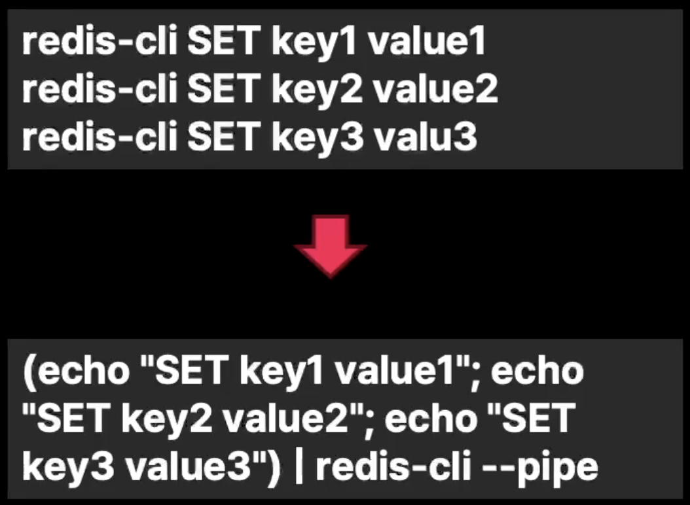

- **네트워크 왕복 횟수 감소**
    - Redis Pipelining은 여러 명령어를 한 번에 서버로 전송하여 네트워크 왕복 횟수를 줄이는 방식
    - 이 방식은 여러 명령을 개별적으로 보내는 것보다 훨씬 빠르게 처리되며, 네트워크 성능 최적화와 명령어 처리 속도를 향상
- **성능 최적화**
    - 네트워크 오버헤드(네트워크 요청과 응답 간의 시간 지연)를 줄여 성능을 극대화할 수 있음
    - 특히, 클라이언트와 서버 간의 통신이 빈번할 때 효과적으로 활용

### 성능 최적화 전략 : 메모리 최적화

- **데이터 압축 사용 및 메모리 정리**
    - Redis는 메모리 기반 데이터 저장소이므로, 메모리 사용량을 최소화하는 것이 성능 최적화에 매우 중요
    - 데이터를 압축하거나 효율적으로 저장하는 방법을 통해 메모리 사용을 줄일 수 있음
    - Redis는 ziplist나 intset과 같은 메모리 효율적인 자료구조를 사용하여 저장 공간을 최적화
- **LRU/LFU 정책**
    - Least Recently Used (LRU) 또는 Least Frequently Used (LFU) 알고리즘을 사용하여 자주 사용되지 않는 데이터를 자동으로 삭제
    - 메모리 부족 시, 오래 사용되지 않는 데이터를 삭제함으로써 메모리 공간을 확보

### 성능 최적화 전략 : RDB vs AOF

→ 데이터 복붙이나 데이터 손실을 방지하기 위해 사용(각각의 특성에 맞게 사용)

| **RDB** | **AOF** |
| --- | --- |
| Redis 데이터를 **주기적으로 스냅샷 형태로 디스크에 저장** | Redis의 **모든 데이터 변경 사항을 순차적으로 기록** |
| 주기적으로 저장된 스냅샷을 사용하여 시스템 재시작 시 데이터를 복구 | 시스템 재시작 시, 모든 변경 기록을 재생하여 완전한 복구가 가능 |
| RDB는 저장 작업이 주기적으로 이루어지기 때문에, 시스템의 성능에 미치는 영향이 적음 | 지속적으로 로그를 기록해야 하므로 시스템 부하가 RDB에 비해 더 높음 |
| 그러나 스냅샷 간격 동안의 변경 사항은 저장되지 않으므로, 데이터 손실 가능성이 있음 | AOF 파일 크기는 시간이 지남에 따라 커질 수 있으므로, 주기적으로 AOF 파일을 압축하거나 재작성(rewrite)하는 작업이 필요 |
- **적절한 영속성 설정**
    - RDB는 고성능을 요구하는 환경에 적합하며, 데이터 손실 가능성이 크지 않은 경우에 사용
    - AOF는 데이터 손실을 최소화해야 하는 상황에서 유용함
    - RBD와 AOF를 병합하여 설정하면 성능과 데이터 안정성 간의 균형을 맞출 수 있음
    
    `ex_` 전사상거래(커머스 사이트)를 운영할 경우 RDB 스냅샷을 주기적으로 저장 → 전체 데이터 상태 유지, AOF를 사용해서 거래정보와 같은 중요한 데이터를 실시간으로 기록해서 데이터 손실을 방지
    

### 성능 최적화 전략 : 파티셔닝

- **Redis Cluster의 파티셔닝 활용**
    - Redis Cluster는 파티셔닝을 통해 데이터를 여러 노드에 분산 저장하여 수평적 확장성을 제공
    - 파티셔닝은 데이터를 해시 슬롯을 기반으로 여러 노드에 분산시켜, 성능 저하 없이 대규모 데이터를 처리할 수 있도록 도와줌
        
        → 수백만명의 사용자가 동시에 접속을 해도 성능 유지 가능, 예를 들아 하나의 노드가 다운되더라도 나머지 노드를 사용하는 사용자들은 해당 오류를 겪을 일이 많이 없어진다.
        
    - 파티셔닝은 시스템의 부하를 분산시켜, 각 노드가 처리해야 하는 데이터 양을 줄임으로써 성능을 향상

### 성능 최적화 전략 : TTL(Time-To-Live) 설정

- **자동 데이터 제거**
    - Redis는 각 키에 대해 TTL(Time-To-Live)을 설정하여, 일정 시간이 지나면 자동으로 데이터를 삭제하는 기능을 제공
    - 불필요한 데이터가 계속 메모리를 차지하지 않도록 관리할 수 있음
- **메모리 관리 최적화**
    - TTL을 적절히 설정하면 오래된 데이터가 메모리에서 자동으로 제거되므로, 지속적인 메모리 사용량을 줄일 수 있음
    - 에를 들어, 쇼핑몰에서 장바구니 데이터를 TTL로 관리하여 일정 시간 후 자동으로 삭제하면, 사용하지 않는 데이터를 관리하지 않아도 됨
        
        `SET user:session123 “data” EX 3600` → 세션 데이터를 1시간 후 만료되도록 설정
        

### 성능 최적화 전략 : Pipelining

- **네트워크 왕복 횟수 감소**
    - 여러 명령어를 한 번에 서버에 보내는 방식으로, 네트워크 왕복 횟수를 줄여 네트워크 성능을 최적화
    - 여러 명령어를 개별적으로 처리하는 것보다 훨씬 더 빠르게 처리할 수 있음
- **명령어 처리 속도 향상**
    - Pipelining을 사용하면, 클라이언트와 서버 간의 네트워크 지연을 최소화하고 동시 처리가 가능해져 성능이 크게 향상
    - 특히 대규모 작업에서 Pipelining을 사용하면 네트워크 부하를 줄이고, 더 빠른 응답 시간을 제공할 수 있음

### Redis의 보안 설정

- **인증 설정**
    - requirepass 설정을 통해 패스워드 인증 도입
        
        ```bash
        (redis.conf) requirepass my_secure_password AUTH my_secure_password
        ```
        
- **방화벽 설정**
    - 외부 접근을 제한하기 위한 방화벽 설정
        
        → 보안 설정없이 운영할 경우 외부 네트워크에 쉽게 노출될수 있어 방화벽 설정하여 외부 접근을 제한하는 것이 중요
        
        → Redis는 기본적으로 TCP 포트 6379에서 동작 ⇒ 방화벽을 통해 import하는 외부 접근을 차단
        
- **TLS(전송 계층 보안)**
    - 네트워크 통신 중 데이터 암호화를 통해 보안성 향상 (Redis는 기본적으로 평문으로 데이터를 주고 받기때문에 필요)
        
        → 클라이언트와 서버와의 통신이 모두 암호화 ⇒ 외부에서 통신 내용을 엿보거나 접근할 수 없도록 제어
        
        ```bash
        redis-cli --tls --cert /path/to/client-cert.pem --key /path/to/client-key.pem --cacert /path/to/ca-cert.pem -h redis-server-host
        ```
        

### Redis 사용 시 잠재적인 문제와 해결 방법 : 메모리 부족 문제

- **원인**
    - Redis는 메모리에 데이터를 저장하므로, 저장되는 데이터의 양이 많아질수록 메모리 사용량이 증가
    - 일정 메모리 한도에 도달하면 더 이상 새로운 데이터를 저장할 수 없게 되어 문제가 발생
    - 메모리 부족은 주로 캐시 데이터나 대규모 키 저장소를 운영할 때 자주 발생함
- **해결 방법**
    - maxmemory 설정
    - LRU/LFU 정책 적용
    - 데이터 압축 및 데이터 타입 최적화

### Redis 사용 시 잠재적인 문제와 해결 방법 : 복제 지연 (Replication Lag)

- **원인**
    - 네트워크 지연 : Master에서 Slave로 데이터가 전송되는 동안 네트워크 지연이 발생할 수 있음 네트워크 대역폭이 낮거나, 여러 노드 간의 거리가 먼 경우 지연이 심화될 수 있음
    - Slave의 성능 저하 : Slave 노드가 처리해야 할 작업이 많거나, CPU, 메모리 등 자원 부족으로 인해 지연이 발생
    - 대규모 쓰기 작업 : Master에서 대량의 쓰기 작업이 발생할 때 Slave 노드가 그 작업을 처리하는 데 시간이 오래 걸려 지연이 발생
- **해결 방법**
    - 복제 압축 활성화
    - 비동기 복제 사용
    - Slave의 성능 최적화
        
        → Slave 성능을 높여 복제 속도를 개선, Slave 노드에서 자원을 충분히 할당, 최적화된 하드웨어 구성을 사용하는 것이 좋음.
        
        `ex_` 글로벌 서비스에서 Master와 Slave 노드가 다른 지역에 있는 경우 네트워크 지연으로 복제 속도가 느려질 수 있음. → 이런 경우 Slave 노드 성능을 높여 복제 데이터를 압축하여 전송 속도를 개선하는 것이 중요
        

### Redis 사용 시 잠재적인 문제와 해결 방법 : 데이터 영속성 및 복구 시간

- **원인**
    - AOF 파일 크기 증가 : Redis는 데이터를 변경할 때마다 AOF 파일에 기록하므로, 시간이 지남에 따라 AOF 파일이 커짐
    - AOF 파일이 커질수록 Redis가 재시작 시 해당 로그를 모두 재생하는 데 시간이 오래 걸리게 됨
    - 주기적인 AOF 파일 압축 미실행 : Redis는 주기적으로 AOF 파일을 압축 및 재 작성하여 파일 크기를 줄일 수 있지만, 이 작업이 제대로 실행되지 않으면 파일 크기가 계속 증가
- **해결 방법**
    - AOF 파일 압축 및 재작성 → AOF 파일 백업 중요
    - AOF와 RDB 병행 사용

### Redis를 활용한 복합 아키텍처 예시 : Redis. + MySQL/PostgreSQL

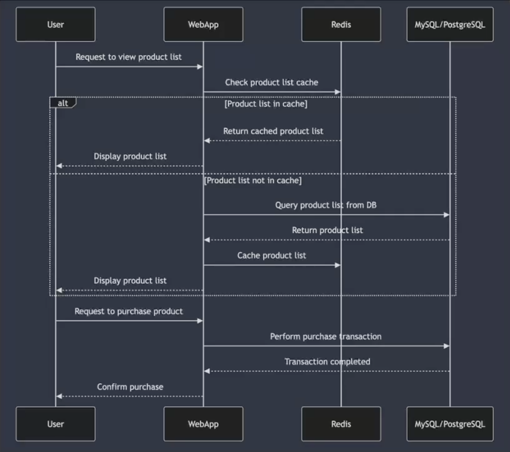

- Redis는 자주 조회되는 데이터(예: 사용자 프로필, 세션 정보, 상품 목록)를 캐시로 저장하여 빠르게 제공하며, 데이터베이스에 대한 읽기 부하를 줄임
- 관계형 데이터베이스는 복잡한 트랜잭션 또는 복잡한 쿼리 작업을 처리하여 데이터 일관성을 유지하고 복잡한 작업을 효율적으로 처리
- **사용 사례**
    - 전자상거래 플랫폼
    - 웹 애플리케이션 세션 관리

### Redis를 활용한 복합 아키텍처 예시 : Redis + Kafka

→ 실시간 데이터 스트리밍 및 캐싱이 필요한 시스템에서 유용

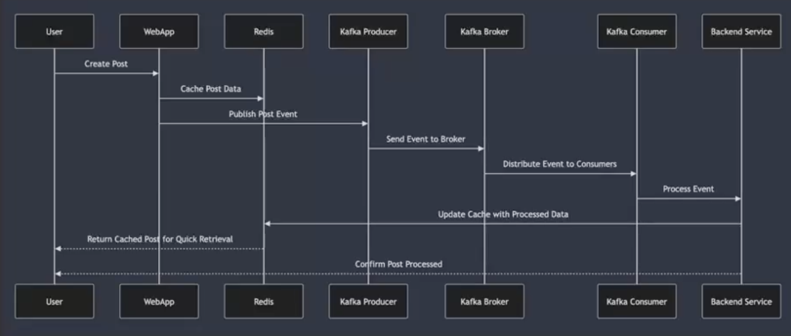

- Redis는 실시간 데이터의 캐시 역할을 맡아 빠른 조회 및 데이터 업데이트를 처리하고, Kafka는 대규모 실시간 이벤트와 데이터 스트리밍을 관리하여 데이터를 안정적으로 전송하고 처리
- Kafka는 분산 메시지 시스템으로 대용량의 데이터를 프로듀서에서 컨슈머로 효율적으로 전달하며, Redis는 메시징 프로세스 중에 데이터 캐싱을 통해 빠른 처리와 응답을 제공
- **사용 사례**
    - 실시간 로그 처리
    - 실시간 알림 시스템 → 소셜 미디어 플랫폼에서 사용자가 게시글을 작성할 때 Kafka는 해당 이벤트를 실시간으로 전송하고 Redis는 해당 게시글 데이터를 캐시에 저장해서 다른 사용자에게 빠르게 피드 제공 가능

### Redis를 활용한 복합 아키텍처 예시 : Redis + Elasticsearch

→ 고성능 캐시 + 복잡한 검색 작업이 필요한 시스템에서 유용 (`ex_` 상품 거래 플랫폼)

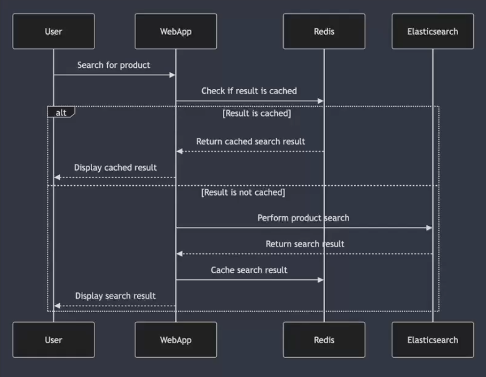

- Redis는 고성능 캐시로 사용되어 자주 조회되는 데이터를 빠르게 제공
- Elasticsearch는 검색 엔진 역할을 수행하여, 대규모 데이터셋에서 복잡한 검색 작업(예: 전체 텍스트 검색, 필터링, 집계 등)을 처리
- Redis는 검색된 데이터를 캐싱하여 검색 성능을 더욱 향상시킬 수 있으며, Elasticsearch는 정교한 검색 결과를 제공하여 데이터 분석 및 검색 기능을 강화
- **사용 사례**
    - 전자상거래 검색 시스템
    - 로그 분석 시스템